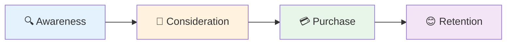

# 🚀 BizMentor AI - Enhanced Research Report Structure v2.0

<div style="background: linear-gradient(135deg, #667eea 0%, #764ba2 100%); padding: 20px; border-radius: 10px; color: white; margin-bottom: 20px;">
<h2 style="margin: 0; color: white;">📊 Report Metadata</h2>
</div>

```
Business Name: [Auto-fill from intake]
Report Type: [Idea Validation / Business Growth / Turnaround Strategy]
Generated On: [Date & Time]
Research Depth: [Quick Scan / Standard / Deep Dive]
Total Sources Analyzed: [Number]
Confidence Score: 🟢 High / 🟡 Medium / 🔴 Low
```

---

## <span style="color: #667eea;">📊 SECTION 1: Executive Intelligence Dashboard</span>

<div style="background-color: #f0f4ff; padding: 15px; border-left: 5px solid #667eea; margin: 10px 0;">
<strong>Purpose:</strong> 60-second snapshot for decision makers
</div>

### <span style="color: #4CAF50;">🎯 Key Metrics at a Glance</span>

| Metric | Value | Status |
|--------|-------|--------|
| **Viability Score** | X/10 | 🟢/🟡/🔴 |
| ↳ Market Potential | X/10 | - |
| ↳ Competition Level | X/10 | - |
| ↳ Execution Feasibility | X/10 | - |
| **Market Opportunity** | ₹X Cr TAM \| ₹X Cr SAM | - |
| **Time to Revenue** | X months | - |
| **Capital Required** | ₹X - ₹Y Lakhs | - |
| **Risk Level** | 🔴 High / 🟡 Medium / 🟢 Low | - |

### <span style="color: #FF6B6B;">🔥 Critical Insights (Top 5)</span>

1. **[Most Important Finding]** - <span style="color: #667eea;">[Detail]</span>
2. **[Key Opportunity]** - <span style="color: #4CAF50;">[Detail]</span>
3. **[Biggest Risk]** - <span style="color: #FF6B6B;">[Detail]</span>
4. **[Unique Advantage]** - <span style="color: #FFA726;">[Detail]</span>
5. **[Immediate Action Needed]** - <span style="color: #AB47BC;">[Detail]</span>

### <span style="color: #2196F3;">⚡ Quick Verdict</span>

<div style="background-color: #e3f2fd; padding: 20px; border-radius: 8px; margin: 15px 0;">

**Recommendation:** <span style="color: #4CAF50; font-size: 18px; font-weight: bold;">✅ STRONG GO</span> / <span style="color: #FFA726; font-size: 18px; font-weight: bold;">⚠️ PROCEED WITH CAUTION</span> / <span style="color: #FF6B6B; font-size: 18px; font-weight: bold;">❌ PIVOT NEEDED</span>

**One-Liner:** *[Single sentence verdict with confidence]*

**Best-Case Scenario:** <span style="color: #4CAF50;">[Optimistic but realistic outcome]</span>

**Worst-Case Scenario:** <span style="color: #FF6B6B;">[Conservative downside assessment]</span>

</div>

---

## <span style="color: #667eea;">📝 SECTION 2: Business Blueprint</span>

<div style="background-color: #f0f4ff; padding: 15px; border-left: 5px solid #667eea; margin: 10px 0;">
<strong>Purpose:</strong> Crystal-clear understanding of what this business is and does
</div>

### <span style="color: #4CAF50;">2.1 Core Business Definition</span>

| Aspect | Details |
|--------|---------|
| **Business Model** | <span style="color: #667eea;">[B2B / B2C / B2B2C / Marketplace / SaaS / etc.]</span> |
| **Value Proposition** | *[What problem does it solve? For whom?]* |
| **Revenue Model** | [How does money come in?] |
| **Delivery Method** | [Online / Offline / Hybrid / Product / Service] |

### <span style="color: #FFA726;">2.2 Current Stage Assessment</span>

<div style="background-color: #fff3e0; padding: 15px; border-radius: 8px; margin: 10px 0;">

**Stage:** <span style="color: #FF6B6B;">[Idea / MVP / Early Revenue / Growth / Scaling]</span>

| Metric | Value |
|--------|-------|
| **Monthly Revenue** | ₹X (if existing) |
| **Customer Count** | X active customers |
| **Team Size** | X people (roles: ...) |
| **Tech Readiness** | 🟢 Advanced / 🟡 Basic / 🔴 None |
| **Legal Status** | [Not Registered / Sole Proprietor / LLP / Pvt Ltd] |

</div>

### <span style="color: #AB47BC;">2.3 Founder/Team Profile</span>

- **Founder Experience:** <span style="color: #667eea;">[Domain expertise level: Beginner / Intermediate / Expert]</span>
- **Skin in the Game:** ₹X invested so far
- **Time Commitment:** <span style="color: #4CAF50;">Full-time</span> / <span style="color: #FFA726;">Part-time</span> / <span style="color: #FF6B6B;">Side hustle</span>
- **Critical Skills Gap:** <span style="color: #FF6B6B;">[What's missing?]</span>
- **Network Strength:** [Industry connections, advisors, mentors]

### <span style="color: #2196F3;">2.4 Geographic & Demographic Focus</span>

```
Primary Market: [City / State / India / Global]
Target Cities: [Tier 1 / Tier 2 / Tier 3]
Language Focus: [Hindi / English / Regional]
Urban vs Rural: [Split or focus area]
```

---

## <span style="color: #667eea;">🎯 SECTION 3: Market Demand & Opportunity Analysis</span>

<div style="background-color: #f0f4ff; padding: 15px; border-left: 5px solid #667eea; margin: 10px 0;">
<strong>Purpose:</strong> Validate karo ki market actually hai ya nahi
</div>

### <span style="color: #4CAF50;">3.1 Market Size & Growth</span>

<div style="background-color: #e8f5e9; padding: 20px; border-radius: 8px; margin: 15px 0;">

#### 📊 Market Sizing

| Market Layer | Size | Notes |
|--------------|------|-------|
| **TAM** (Total Addressable Market) | <span style="color: #4CAF50; font-size: 20px; font-weight: bold;">₹X Cr</span> | *Data Source: [XYZ Report, 2024]* |
| **SAM** (Serviceable Addressable) | <span style="color: #2196F3; font-size: 18px; font-weight: bold;">₹X Cr</span> | *Calculation: [Logic]* |
| **SOM** (Serviceable Obtainable - Yr 1) | <span style="color: #667eea; font-size: 16px; font-weight: bold;">₹X Cr</span> | *Target Share: X%* |

**CAGR (5-Year Growth):** <span style="color: #4CAF50; font-size: 18px;">↗ X% annually</span>

**Market Maturity:** <span style="color: #FFA726;">[Emerging / Growing / Mature / Declining]</span>

</div>

### <span style="color: #FF6B6B;">3.2 Demand Indicators & Validation</span>

#### 🔍 Search Volume Trends

- **Google Trends:** <span style="color: #4CAF50;">📈 Growing</span> / <span style="color: #2196F3;">➡️ Stable</span> / <span style="color: #FF6B6B;">📉 Declining</span>
  - Primary Keyword: [keyword] - **X monthly searches in India**
  - Related Terms: [List top 3-5 keywords]

#### 📱 Social Media Signals

| Platform | Metric | Value | Trend |
|----------|--------|-------|-------|
| Instagram | Hashtag Volume | X posts | 🟢/🟡/🔴 |
| YouTube | Content Volume | X videos (Avg X views) | 🟢/🟡/🔴 |
| Reddit/Forums | Discussion Activity | [Active / Moderate / Low] | 🟢/🟡/🔴 |

#### ✅ Problem Validation Checklist

- [✅] **Evidence of Real Pain Point:** <span style="color: #4CAF50;">[Examples from research]</span>
- [✅] **People Actively Seeking Solutions:** <span style="color: #4CAF50;">[Proof points]</span>
- [✅] **Willingness to Pay:** <span style="color: #2196F3;">[Price sensitivity data]</span>

### <span style="color: #AB47BC;">3.3 Market Gaps & White Space</span>

<div style="background-color: #f3e5f5; padding: 15px; border-radius: 8px;">

- **Underserved Segments:** [Which customer groups are ignored?]
- **Geographic Gaps:** [Cities/regions with unmet demand]
- **Product/Service Gaps:** [What's missing in current offerings?]
- **Innovation Opportunities:** [Where can you differentiate?]

</div>

### <span style="color: #2196F3;">3.4 Market Dynamics</span>

```
📅 Seasonal Trends: [Peak months, slow months]
⚖️ Regulatory Catalysts: [Laws/policies driving growth]
💻 Technology Enablers: [Tech making this easier now]
🌊 Cultural Shifts: [Changing behaviors helping this business]
```

---

## <span style="color: #667eea;">👥 SECTION 4: Customer Intelligence & ICP</span>

<div style="background-color: #f0f4ff; padding: 15px; border-left: 5px solid #667eea; margin: 10px 0;">
<strong>Purpose:</strong> Exactly kaun hai tumhara customer aur kya chahiye unhe
</div>

### <span style="color: #4CAF50;">4.1 Ideal Customer Profile (ICP)</span>

<div style="background-color: #e8f5e9; padding: 20px; border-radius: 8px; margin: 15px 0;">

#### 👤 For B2C Businesses

**Demographics:**
| Factor | Profile |
|--------|---------|
| Age | X-Y years |
| Gender | M / F / All |
| Income | ₹X - ₹Y LPA |
| Education | [Level: Graduate / Post-grad / etc.] |
| Occupation | [Job types: IT professional / Student / Homemaker] |
| Location | [Cities: Tier 1 / Tier 2] |

**Psychographics:**
- **Values:** <span style="color: #667eea;">[What do they care about?]</span>
- **Lifestyle:** [How do they live? Urban, health-conscious, tech-savvy]
- **Pain Points:** 
  1. <span style="color: #FF6B6B;">[Pain #1]</span>
  2. <span style="color: #FF6B6B;">[Pain #2]</span>
  3. <span style="color: #FF6B6B;">[Pain #3]</span>
- **Aspirations:** <span style="color: #4CAF50;">[What do they want to become?]</span>

**Behavioral Traits:**
- **Online Behavior:** [Instagram scrollers / LinkedIn readers / YouTube watchers]
- **Purchase Triggers:** [What makes them buy? - Social proof / Discounts / FOMO]
- **Decision Timeline:** <span style="color: #FFA726;">[Impulse / X days / X weeks]</span>
- **Price Sensitivity:** 🔴 High / 🟡 Medium / 🟢 Low

</div>

<div style="background-color: #e3f2fd; padding: 20px; border-radius: 8px; margin: 15px 0;">

#### 🏢 For B2B Businesses

**Company Profile:**
| Factor | Profile |
|--------|---------|
| Industry | [Specific sectors: IT / Manufacturing / Retail] |
| Company Size | X-Y employees, ₹X-Y Cr revenue |
| Location | [Geography: NCR / Bangalore / Mumbai] |
| Tech Stack | [Current tools they use] |

**Decision Maker Profile:**
- **Title/Role:** <span style="color: #667eea;">[CXO / VP / Manager level]</span>
- **Age:** X-Y years
- **Key Challenges:** <span style="color: #FF6B6B;">[Their top 3 pain points]</span>
- **Success Metrics:** [What KPIs do they care about?]

**Buying Process:**
- **Decision Timeline:** <span style="color: #FFA726;">X weeks/months</span>
- **Stakeholders:** [Who all are involved? - IT, Finance, Leadership]
- **Budget Cycle:** [When do they typically buy? - April-June / Oct-Dec]
- **Approval Process:** [Single approval / Committee / Multi-level]

</div>

### <span style="color: #FF6B6B;">4.2 Customer Segmentation</span>

<div style="background-color: #ffebee; padding: 15px; border-radius: 8px;">

**🎯 Primary Segment** (60% of revenue potential):
- **Profile:** [Detailed description]
- **Size:** X potential customers
- **Why Them First:** <span style="color: #667eea;">[Strategic reasoning]</span>

**🎯 Secondary Segment** (30% of revenue potential):
- **Profile:** [Description]
- **Size:** X potential customers

**🎯 Tertiary Segment** (10%):
- **Profile:** [Description]
- **When to Target:** [After establishing primary segment]

</div>

### <span style="color: #AB47BC;">4.3 Customer Pain Points (Ranked by Intensity)</span>

1. **🔥 [CRITICAL PAIN #1]**
   - **Impact:** <span style="color: #FF6B6B;">Costs them ₹X/month or Y hours/week</span>
   - **Current Solutions:** [What do they do now? - Manual work / Competitor product]
   - **Your Solution Fit:** <span style="color: #4CAF50;">[How you solve it 10x better]</span>

2. **🔥 [MAJOR PAIN #2]**
   - **Impact:** [Quantify the hurt]
   - **Current Solutions:** [Existing workarounds]
   - **Your Solution Fit:** [Your advantage]

3. **🔥 [MODERATE PAIN #3]**
   - **Impact:** [Description]
   - **Current Solutions:** [What exists]
   - **Your Solution Fit:** [How you help]

### <span style="color: #2196F3;">4.4 Customer Journey Mapping</span>



| Stage | Customer Behavior | Your Actions |
|-------|-------------------|--------------|
| **🔍 Awareness** | [How do they discover solutions?] | [Content, SEO, ads] |
| **🤔 Consideration** | [What factors do they evaluate?] | [Case studies, demos] |
| **💳 Purchase** | [What tips them to buy?] | [Discount, guarantee] |
| **😊 Retention** | [What keeps them loyal?] | [Support, community] |

### <span style="color: #FFA726;">4.5 Voice of Customer (VoC)</span>

<div style="background-color: #fff3e0; padding: 15px; border-radius: 8px; font-style: italic;">

**💬 Direct Quotes from Research:**

> *"[Customer quote from forum/review showing frustration]"*  
> — Anonymous user, Reddit r/[subreddit]

> *"[Another quote highlighting pain point or desire]"*  
> — Review on Google/Amazon

**Common Complaints about Existing Solutions:**
1. <span style="color: #FF6B6B;">[Complaint theme #1: Too expensive]</span>
2. <span style="color: #FF6B6B;">[Complaint theme #2: Poor customer service]</span>
3. <span style="color: #FF6B6B;">[Complaint theme #3: Complicated to use]</span>

</div>

---

## <span style="color: #667eea;">⚔️ SECTION 5: Competitive Intelligence</span>

<div style="background-color: #f0f4ff; padding: 15px; border-left: 5px solid #667eea; margin: 10px 0;">
<strong>Purpose:</strong> Kaun hai market mein aur kaise tumhe unse alag hona hai
</div>

### <span style="color: #4CAF50;">5.1 Competitive Landscape Overview</span>

| Aspect | Assessment |
|--------|------------|
| **Market Structure** | <span style="color: #667eea;">[Fragmented / Consolidated / Monopolistic]</span> |
| **Number of Players** | X direct competitors, Y indirect |
| **Competitive Intensity** | 🔴 High / 🟡 Medium / 🟢 Low |
| **Barrier to Entry** | 🔴 High / 🟡 Medium / 🟢 Low |

### <span style="color: #FF6B6B;">5.2 Direct Competitor Analysis</span>

<div style="background-color: #ffebee; padding: 20px; border-radius: 8px; margin: 15px 0;">

#### 🥇 Competitor #1: [NAME]

| Attribute | Details |
|-----------|---------|
| **Overview** | [What they do, founded when] |
| **Market Position** | <span style="color: #4CAF50;">🏆 Market Leader</span> / <span style="color: #FFA726;">🎯 Strong Challenger</span> / <span style="color: #2196F3;">🎪 Niche Player</span> |
| **Revenue Estimate** | ₹X Cr annually |
| **Customer Base** | ~X customers |
| **Pricing** | ₹X - ₹Y (positioning: Premium / Mid-range / Budget) |

**💪 Strengths:**
- <span style="color: #4CAF50;">✓ [Strength 1: Strong brand recognition]</span>
- <span style="color: #4CAF50;">✓ [Strength 2: Wide distribution network]</span>
- <span style="color: #4CAF50;">✓ [Strength 3: Deep pockets for marketing]</span>

**⚠️ Weaknesses:**
- <span style="color: #FF6B6B;">✗ [Weakness 1: Slow customer support]</span>
- <span style="color: #FF6B6B;">✗ [Weakness 2: Outdated technology]</span>
- <span style="color: #FF6B6B;">✗ [Weakness 3: No presence in Tier 2 cities]</span>

**📊 Online Presence:**
- Website Traffic: **X monthly visitors** (SimilarWeb estimate)
- Social Media: **X followers** on Instagram
- Reviews: **X/5 stars** (Y reviews on Google)

**🎯 Your Competitive Advantage Over Them:**
<span style="color: #667eea; font-weight: bold;">[How you're different/better - be specific and realistic]</span>

</div>

<div style="background-color: #fff3e0; padding: 20px; border-radius: 8px; margin: 15px 0;">

#### 🥈 Competitor #2: [NAME]
*[Same structure as above]*

</div>

<div style="background-color: #f3e5f5; padding: 20px; border-radius: 8px; margin: 15px 0;">

#### 🥉 Competitor #3: [NAME]
*[Same structure as above]*

</div>

### <span style="color: #AB47BC;">5.3 Indirect Competitors & Substitutes</span>

- **Alternative Solutions:** <span style="color: #667eea;">[What else do customers currently use?]</span>
- **Substitute Products:** [Different solution, same outcome achieved]
- **DIY Options:** [Can customers do it themselves? How common is this?]

### <span style="color: #2196F3;">5.4 Competitive Positioning Matrix</span>

```
                    💰 High Price
                         |
           Competitor A  |  Competitor B
          (Premium)      |  (Premium Quality)
                         |
🔧 Low Quality ---------|--------- 🌟 High Quality
                         |
              YOU        |  Competitor C
          (Value Play)   |  (Established)
                         |
                    💸 Low Price
```

### <span style="color: #FFA726;">5.5 SWOT Analysis</span>

<div style="background-color: #fff3e0; padding: 20px; border-radius: 8px;">

| <span style="color: #4CAF50;">**STRENGTHS**</span><br>*(Internal, Positive)* | <span style="color: #FF6B6B;">**WEAKNESSES**</span><br>*(Internal, Negative)* |
|---------|-----------|
| <span style="color: #4CAF50;">✓ [Your unique advantage #1]</span> | <span style="color: #FF6B6B;">✗ [Your limitation #1]</span> |
| <span style="color: #4CAF50;">✓ [Your unique advantage #2]</span> | <span style="color: #FF6B6B;">✗ [Your limitation #2]</span> |
| <span style="color: #4CAF50;">✓ [Your unique advantage #3]</span> | <span style="color: #FF6B6B;">✗ [Your limitation #3]</span> |

| <span style="color: #2196F3;">**OPPORTUNITIES**</span><br>*(External, Positive)* | <span style="color: #FFA726;">**THREATS**</span><br>*(External, Negative)* |
|-------------|--------|
| <span style="color: #2196F3;">↗ [Market trend favoring you #1]</span> | <span style="color: #FFA726;">⚠ [Risk from outside #1]</span> |
| <span style="color: #2196F3;">↗ [Market trend favoring you #2]</span> | <span style="color: #FFA726;">⚠ [Risk from outside #2]</span> |
| <span style="color: #2196F3;">↗ [Market trend favoring you #3]</span> | <span style="color: #FFA726;">⚠ [Risk from outside #3]</span> |

</div>

### <span style="color: #667eea;">5.6 Barriers to Entry & Your Moat</span>

**🚧 Barriers for NEW Entrants:**
- **Capital Requirements:** ₹X minimum needed to compete
- **Regulatory Hurdles:** [Licenses, certifications - difficulty level]
- **Network Effects:** [Do incumbents benefit from user base?]
- **Brand Loyalty:** [How sticky are customers to existing brands?]
- **Technology Barriers:** [Technical complexity or IP protection]

**🏰 Your Moat Strategy** (How you'll defend once successful):
<span style="color: #4CAF50;">[Your defensibility plan - network effects, brand, tech, switching costs]</span>

---

## <span style="color: #667eea;">💰 SECTION 6: Financial Blueprint & Unit Economics</span>

<div style="background-color: #f0f4ff; padding: 15px; border-left: 5px solid #667eea; margin: 10px 0;">
<strong>Purpose:</strong> Paisa kahan se aayega, kitna lagega, kab break-even hoga
</div>

### <span style="color: #4CAF50;">6.1 Revenue Model Deep Dive</span>

<div style="background-color: #e8f5e9; padding: 20px; border-radius: 8px; margin: 15px 0;">

**💵 Primary Revenue Stream** (X% of total revenue):
- **Model Type:** <span style="color: #667eea;">[Subscription / Transaction Fee / Commission / Product Sale / Licensing]</span>
- **Pricing Structure:** ₹X per [unit/month/transaction]
- **Revenue Formula:** `Units × Price × Frequency`
- **Scalability:** 📈 Exponential / ➡️ Linear / 📊 Limited

**💵 Secondary Revenue Stream** (Y%):
- **Model Type:** [Description]
- **Expected Contribution:** ₹X per month by Month 6

**💵 Ancillary Revenue** (Z%):
- **Sources:** [Upsells, cross-sells, partnerships, affiliate]
- **Maturity:** [When does this kick in?]

</div>

### <span style="color: #FF6B6B;">6.2 Pricing Strategy & Validation</span>

<div style="background-color: #ffebee; padding: 20px; border-radius: 8px; margin: 15px 0;">

**💎 Recommended Pricing Tiers:**

| Tier | Price | Features | Target Segment |
|------|-------|----------|----------------|
| **🥉 Basic** | ₹X/month | • [Feature 1]<br>• [Feature 2]<br>• [Feature 3] | <span style="color: #667eea;">[Budget-conscious individuals]</span> |
| **🥈 Pro** | ₹Y/month | • All Basic<br>• [Feature 4]<br>• [Feature 5] | <span style="color: #4CAF50;">[Power users, small businesses]</span> |
| **🥇 Enterprise** | ₹Z/month | • All Pro<br>• [Feature 6]<br>• Priority support | <span style="color: #FFA726;">[Large companies, high volume]</span> |

**📊 Pricing Rationale:**
- **Cost-Plus:** Base cost ₹X + **Y%** markup = ₹Z
- **Value-Based:** Customer gains ₹A value, willing to pay ₹B (B/A = X% capture)
- **Competitive:** Average market price ₹C, positioned at **+/-X%**
- **Psychological:** Using ₹999 vs ₹1000 strategy

**🔍 Price Sensitivity Analysis:**
- **Demand Elasticity:** <span style="color: #4CAF50;">Low (10% price change = 5% demand change)</span> / <span style="color: #FFA726;">Medium</span> / <span style="color: #FF6B6B;">High</span>
- **Anchor Pricing:** [What's reference point? - Competitor pricing / Current cost of problem]
- **Payment Terms:** 
  - ✅ Monthly: Higher churn, lower commitment
  - ✅ Quarterly: 10% discount, better retention
  - ✅ Annual: 20% discount, best cash flow

</div>

### <span style="color: #AB47BC;">6.3 Unit Economics (CRITICAL!)</span>

<div style="background-color: #f3e5f5; padding: 25px; border-radius: 8px; margin: 15px 0; border: 3px solid #AB47BC;">

#### 💰 Per Customer Economics

| Metric | Calculation | Value |
|--------|-------------|-------|
| **Average Transaction Value** | Per purchase | ₹X |
| **Purchase Frequency** | Per year | Y times |
| **Gross Margin** | (Revenue - COGS) / Revenue | Z% |
| **Customer Lifetime** | Average retention | A months |
| **Customer Lifetime Value (LTV)** | ATV × Frequency × Lifetime × Margin | <span style="color: #4CAF50; font-size: 20px; font-weight: bold;">₹B</span> |

#### 📊 Customer Acquisition Economics

| Metric | Calculation | Value |
|--------|-------------|-------|
| **Marketing Cost** | Per customer acquired | ₹X |
| **Sales Cost** | Per customer acquired | ₹Y |
| **Tools & Overhead** | Allocated per customer | ₹Z |
| **Customer Acquisition Cost (CAC)** | Total above | <span style="color: #FF6B6B; font-size: 20px; font-weight: bold;">₹A</span> |
| **CAC Payback Period** | Months to recover CAC | <span style="color: #FFA726; font-weight: bold;">X months</span> |

#### ⚖️ LTV:CAC Ratio

<div style="font-size: 24px; text-align: center; padding: 20px; background-color: white; border-radius: 8px; margin: 10px 0;">
<span style="color: #4CAF50; font-weight: bold;">₹B</span> : <span style="color: #FF6B6B; font-weight: bold;">₹A</span> = 
<span style="color: #667eea; font-size: 32px; font-weight: bold;">X:1</span>
</div>

**Health Check:**
- <span style="color: #4CAF50;">✅ **HEALTHY** if > 3:1</span> (Great unit economics!)
- <span style="color: #FFA726;">⚠️ **MARGINAL** if 1-3:1</span> (Workable but needs improvement)
- <span style="color: #FF6B6B;">❌ **UNSUSTAINABLE** if < 1:1</span> (Losing money per customer!)

**Your Status:** <span style="color: #4CAF50; font-weight: bold;">[Assessment based on calculation]</span>

</div>

<div style="background-color: #e3f2fd; padding: 20px; border-radius: 8px; margin: 15px 0;">

#### 📈 Contribution Margin Analysis

| Line Item | Value |
|-----------|-------|
| **Revenue per Unit** | ₹X |
| **Variable Costs:** | |
| ↳ COGS | ₹Y |
| ↳ Delivery/Fulfillment | ₹Z |
| ↳ Payment Gateway (2-3%) | ₹A |
| ↳ Customer Support | ₹B |
| **Total Variable Cost** | ₹C |
| **Contribution Margin (₹)** | ₹(X-C) |
| **Contribution Margin (%)** | <span style="color: #4CAF50; font-size: 20px; font-weight: bold;">D%</span> |

**Benchmark:** Aim for >40% for SaaS, >30% for services, >20% for products

</div>

### <span style="color: #2196F3;">6.4 Financial Projections (3-Year Roadmap)</span>

<div style="background-color: #e3f2fd; padding: 20px; border-radius: 8px;">

#### 📅 Year 1: Foundation & Traction

| Metric | Target | Notes |
|--------|--------|-------|
| **Revenue** | <span style="color: #4CAF50; font-weight: bold;">₹X Lakhs</span> | Month-by-month ramp-up |
| **Customers** | Y | Avg X new customers/month |
| **Monthly Burn** | ₹Z | Reducing from ₹A to ₹B |
| **Break-Even** | <span style="color: #FFA726; font-weight: bold;">Month X</span> | Or "Not in Year 1" |
| **Cash Needed** | ₹A Lakhs | For full year runway |

#### 📅 Year 2: Growth & Optimization

| Metric | Target | Notes |
|--------|--------|-------|
| **Revenue** | <span style="color: #4CAF50; font-weight: bold;">₹X Cr</span> | 3-5x Year 1 |
| **Customers** | Y | X% retention from Year 1 |
| **Profit Margin** | Z% | Path to profitability |
| **Team Size** | A people | Key hires made |

#### 📅 Year 3: Scale & Profitability

| Metric | Target | Notes |
|--------|--------|-------|
| **Revenue** | <span style="color: #4CAF50; font-weight: bold;">₹X Cr</span> | 2-3x Year 2 |
| **Customers** | Y | Market leadership in niche |
| **Profit Margin** | Z% | Healthy sustainable business |
| **Market Share** | A% | Of TAM/SAM |

</div>

**🔑 Key Assumptions Behind Projections:**
1. <span style="color: #667eea;">[Assumption #1: e.g., "10% monthly customer growth"]</span>
2. <span style="color: #667eea;">[Assumption #2: e.g., "CAC remains stable at ₹X"]</span>
3. <span style="color: #667eea;">[Assumption #3: e.g., "80% customer retention"]</span>
4. <span style="color: #667eea;">[Assumption #4: e.g., "No major regulatory changes"]</span>

### <span style="color: #FFA726;">6.5 Startup Costs & Funding Requirements</span>

<div style="background-color: #fff3e0; padding: 25px; border-radius: 8px; margin: 15px 0;">

#### 💸 Initial Capital Needed: <span style="color: #FF6B6B; font-size: 24px; font-weight: bold;">₹X - ₹Y Lakhs</span>

**Detailed Breakdown:**

| Category | Sub-Items | Cost |
|----------|-----------|------|
| **🛠️ Product Development** | | **₹X L** |
| ↳ Tech Stack | Website/App development | ₹A |
| ↳ Design | UI/UX, branding | ₹B |
| ↳ Testing | QA, beta launch | ₹C |
| **📢 Marketing & Sales** | | **₹Y L** |
| ↳ Website & SEO | Professional site, basic SEO | ₹A |
| ↳ Initial Campaigns | First 3 months ad budget | ₹B |
| ↳ Content Creation | Videos, graphics, copywriting | ₹C |
| ↳ Tools | CRM, email marketing, analytics | ₹D |
| **⚙️ Operations** | | **₹Z L** |
| ↳ Office/Workspace | Co-working / home office setup | ₹A |
| ↳ Equipment | Laptops, furniture, misc | ₹B |
| ↳ Software Licenses | Essential tools (Year 1) | ₹C |
| ↳ Inventory | (If product business) Initial stock | ₹D |
| **⚖️ Legal & Compliance** | | **₹A L** |
| ↳ Registration | Company, GST, trademarks | ₹X |
| ↳ Licenses | Industry-specific permits | ₹Y |
| ↳ Contracts & IP | Legal templates, CA consultation | ₹Z |
| **💰 Working Capital** | | **₹B L** |
| ↳ Runway | X months operating expenses | ₹C |
| ↳ Buffer | Contingency (15-20%) | ₹D |

**📊 Funding Strategy Options:**

1. **🏠 Bootstrapping:** 
   - <span style="color: #4CAF50;">✓ Feasible if you have ₹X L personal savings</span>
   - <span style="color: #FF6B6B;">✗ Slower growth, but 100% ownership</span>

2. **👨‍👩‍👧‍👦 Friends & Family:**
   - Target: ₹Y L realistic
   - Terms: [Loan vs equity, return expectations]

3. **😇 Angel Investment:**
   - Target: ₹Z L (give up ~X% equity)
   - When: After MVP + initial traction

4. **🏦 Bank Loan / MSME Schemes:**
   - Amount: ₹A L
   - Collateral: [What you can pledge]
   - Schemes: MUDRA, Startup India, Stand-Up India

5. **🏛️ Government Grants:**
   - Startup India Seed Fund: Up to ₹20L
   - MSME schemes
   - State-specific programs

</div>

### <span style="color: #667eea;">6.6 Break-Even Analysis</span>

<div style="background-color: #f0f4ff; padding: 20px; border-radius: 8px;">

**Break-Even Calculation:**

| Component | Value |
|-----------|-------|
| **Fixed Costs per Month** | ₹X (rent, salaries, subscriptions) |
| **Contribution Margin per Unit** | ₹Y (revenue - variable costs) |
| **Break-Even Units** | X ÷ Y = **Z units/month** |

**Break-Even Timeline:**
- **Assuming Growth Rate:** X units/month increase
- **Months to Break-Even:** <span style="color: #4CAF50; font-size: 20px; font-weight: bold;">Month Y</span>
- **Customers at Break-Even:** Z customers paying ₹A/month avg

**🎯 Sensitivity Analysis:**
- If growth is 20% faster → Break-even in Month (Y-2)
- If CAC is 30% higher → Break-even in Month (Y+3)
- If pricing is 15% lower → Break-even in Month (Y+4)

</div>

---

## <span style="color: #667eea;">🚀 SECTION 7: Go-to-Market & Growth Strategy</span>

<div style="background-color: #f0f4ff; padding: 15px; border-left: 5px solid #667eea; margin: 10px 0;">
<strong>Purpose:</strong> Pehla customer kaise laayenge aur growth kaise scale karenge
</div>

### <span style="color: #4CAF50;">7.1 Market Entry Strategy (Phased Approach)</span>

<div style="background-color: #e8f5e9; padding: 20px; border-radius: 8px; margin: 15px 0;">

#### 🎯 Phase 1: LAUNCH (Month 1-3)

| Aspect | Details |
|--------|---------|
| **Target** | <span style="color: #4CAF50; font-weight: bold;">X customers, ₹Y revenue</span> |
| **Geographic Focus** | [Single city: Delhi NCR / Bangalore / Mumbai] |
| **Customer Focus** | [Specific niche: e.g., "Tech startup founders in NCR"] |
| **Why This Approach** | <span style="color: #667eea;">[Strategic reasoning: easier to service, word-of-mouth, test & iterate]</span> |
| **Success Metric** | X paying customers + Y% satisfaction rating |

#### 🎯 Phase 2: EXPANSION (Month 4-9)

| Aspect | Details |
|--------|---------|
| **Target** | <span style="color: #2196F3; font-weight: bold;">X customers, ₹Y revenue</span> |
| **Geographic Focus** | Expand to [Y cities / full Tier 1] |
| **Customer Focus** | Add [secondary segment] |
| **Key Activities** | Hire sales team, scale marketing, automate operations |

#### 🎯 Phase 3: SCALE (Month 10-12)

| Aspect | Details |
|--------|---------|
| **Target** | <span style="color: #FFA726; font-weight: bold;">X customers, ₹Y revenue</span> |
| **Geographic Focus** | [Pan-India / Tier 2 cities / International] |
| **Customer Focus** | All segments, optimize mix |
| **Key Activities** | Fundraising, team expansion, product v2.0 |

</div>

### <span style="color: #FF6B6B;">7.2 Customer Acquisition Channels (Ranked by Priority)</span>

<div style="background-color: #ffebee; padding: 20px; border-radius: 8px; margin: 15px 0;">

#### 🥇 CHANNEL #1: [e.g., Instagram Organic + Paid]

**Why This First:**  
<span style="color: #667eea;">[Based on ICP research: "Our target customers (age 25-35) spend 2+ hours daily on Instagram, actively follow lifestyle brands, and trust influencer recommendations"]</span>

| Metric | Target |
|--------|--------|
| **Estimated CAC** | ₹X (organic) / ₹Y (paid ads) |
| **Expected Conversion Rate** | Z% (industry benchmark: A%) |
| **Monthly Reach Potential** | B people |
| **Budget (Month 1-3)** | ₹C total (₹D organic effort + ₹E ads) |

**Content Strategy:**
- **Reels** (5/week): [Product demos, before-after, testimonials]
- **Carousel Posts** (3/week): [Educational, tips, case studies]
- **Stories** (Daily): [Behind-scenes, polls, Q&A]
- **Content Pillars:** 60% educational, 30% engaging, 10% promotional

**Success Metrics:**
- **Month 1:** X followers, Y engagement rate, Z website clicks
- **Month 2:** A followers, B leads via DM
- **Month 3:** C followers, D sales from Instagram

</div>

<div style="background-color: #fff3e0; padding: 20px; border-radius: 8px; margin: 15px 0;">

#### 🥈 CHANNEL #2: [e.g., Google Ads - Search]

**Why This Second:**  
<span style="color: #667eea;">[High purchase intent: "People searching for [your solution] are actively looking to buy, not just browsing"]</span>

| Metric | Target |
|--------|--------|
| **Budget** | ₹X/month (starting conservative) |
| **Target Keywords** | [Keyword 1], [Keyword 2], [Keyword 3] (5-10 total) |
| **Expected CTR** | Y% (aim for > 3%) |
| **Expected Conversion** | Z% (industry avg: A%) |
| **Cost per Click** | ₹B (estimated) |
| **ROI Target** | 3:1 (₹3 revenue per ₹1 spent) |

**Campaign Structure:**
- **Campaign 1:** Branded keywords (high conversion, cheap)
- **Campaign 2:** Problem-based keywords (e.g., "how to solve X")
- **Campaign 3:** Competitor keywords (expensive but worthwhile)

</div>

<div style="background-color: #f3e5f5; padding: 20px; border-radius: 8px; margin: 15px 0;">

#### 🥉 CHANNEL #3: [e.g., Strategic Partnerships]

**Why This Third:**  
<span style="color: #667eea;">[Leverage existing customer bases: "Partner businesses already have trust with our target customers"]</span>

| Metric | Target |
|--------|--------|
| **Partner Type** | [Complementary businesses, not competitors] |
| **Partnership Model** | Revenue share (X%) / Referral fee (₹Y per customer) / Co-marketing |
| **Target Partners** | 1. [Specific Company A]<br>2. [Specific Company B]<br>3. [Specific Company C] |
| **Expected Leads/Month** | X leads → Y conversions (Z% conversion rate) |

**Pitch to Partners:**
- **Their Benefit:** [Additional revenue stream / Value-add for their customers / No cost to them]
- **Your Benefit:** [Warm leads / Lower CAC / Credibility boost]

</div>

*[Continue structure for Channels #4, #5, #6, #7 - typically cover 5-7 channels total]*

---

### <span style="color: #AB47BC;">7.3 Marketing Messaging & Positioning</span>

<div style="background-color: #f3e5f5; padding: 20px; border-radius: 8px;">

**🎯 Core Message (One-Liner):**  
<div style="font-size: 20px; font-weight: bold; color: #667eea; padding: 15px; background-color: white; border-radius: 8px; text-align: center; margin: 10px 0;">
"[Your unique value proposition in one sentence]"
</div>

**📝 Messaging Framework:**

| Component | Content |
|-----------|---------|
| **Headline** | <span style="color: #FF6B6B; font-weight: bold;">[Attention-grabbing hook]</span> |
| **Problem** | <span style="color: #FFA726;">[Pain point you solve - make them feel it]</span> |
| **Solution** | <span style="color: #4CAF50;">[How you solve it - specific and clear]</span> |
| **Proof** | <span style="color: #2196F3;">[Why they should believe you - testimonials/data]</span> |
| **Call-to-Action** | <span style="color: #667eea; font-weight: bold;">[What action to take NOW]</span> |

**🎭 Positioning Statement:**

> "For **[target customer]**, who **[pain point]**,  
> **[Your Brand]** is a **[category]** that **[unique benefit]**.  
> Unlike **[competitors]**, we **[key differentiator]**."

**Example:**  
*"For busy working professionals, who struggle to maintain fitness due to time constraints, FitQuick is a home workout app that delivers gym-quality results in just 20 minutes a day. Unlike generic fitness apps, we provide personalized AI coaching that adapts to your schedule and equipment."*

**💬 Tagline Options:**
1. <span style="color: #667eea;">[Option 1: Short, memorable, benefit-focused]</span>
2. <span style="color: #4CAF50;">[Option 2: Emotional, aspirational]</span>
3. <span style="color: #FFA726;">[Option 3: Problem-solution focused]</span>

</div>

### <span style="color: #2196F3;">7.4 Content & Social Media Strategy</span>

<div style="background-color: #e3f2fd; padding: 20px; border-radius: 8px;">

**📊 Content Pillars (60-30-10 Rule):**

1. **📚 EDUCATIONAL (60%)** - Build trust, provide value
   - [Topic 1 that helps ICP: e.g., "5 budgeting mistakes millennials make"]
   - [Topic 2: e.g., "How to choose the right X"]
   - [Topic 3: e.g., "Step-by-step guide to Y"]

2. **🎉 ENGAGING (30%)** - Build community, personality
   - [Behind-the-scenes content]
   - [Customer success stories]
   - [Team culture, founder journey]
   - [Industry memes, relatable content]

3. **💰 PROMOTIONAL (10%)** - Direct selling
   - [Product launches]
   - [Limited-time offers]
   - [Case studies with CTA]

**📱 Platform-Wise Strategy:**

| Platform | Frequency | Content Types | Primary Goal |
|----------|-----------|---------------|--------------|
| **Instagram** | 5 posts/week + daily stories | Reels, carousels, stories | <span style="color: #4CAF50;">Brand awareness + leads</span> |
| **LinkedIn** (B2B) | 3 posts/week | Thought leadership, case studies | <span style="color: #2196F3;">B2B leads + credibility</span> |
| **YouTube** | 1-2 videos/week | Tutorials, vlogs, testimonials | <span style="color: #FF6B6B;">SEO + deep engagement</span> |
| **WhatsApp** | As needed | Community updates, offers | <span style="color: #4CAF50;">Retention + direct sales</span> |

**📅 Weekly Content Calendar Framework:**

| Day | Primary Platform | Content Type | Example |
|-----|------------------|--------------|---------|
| **Monday** | Instagram | Educational Reel | "3 signs you need [your solution]" |
| **Tuesday** | LinkedIn | Article/Insight | Industry trend analysis |
| **Wednesday** | Instagram | Testimonial Carousel | Customer success story |
| **Thursday** | YouTube | Tutorial Video | How-to guide |
| **Friday** | Instagram | Engaging/Fun | Week recap, team culture |

</div>

### <span style="color: #FFA726;">7.5 Sales Strategy</span>

<div style="background-color: #fff3e0; padding: 20px; border-radius: 8px;">

#### For B2C Business:

**🛒 Sales Funnel:**

```
Awareness → Interest → Consideration → Purchase → Retention
    ↓          ↓            ↓             ↓           ↓
(Social    (Landing    (Email          (Checkout   (Follow-up
 Media)     Page)       Sequence)       Flow)       Emails)
```

**Conversion Optimization:**
- **Landing Page Elements:**
  - [ ] Clear headline with benefit
  - [ ] Trust badges (SSL, reviews, media mentions)
  - [ ] Social proof (testimonials, user count)
  - [ ] Clear CTA (above the fold)
  - [ ] Risk reversal (money-back guarantee)

- **Checkout Flow:**
  - [ ] Guest checkout option
  - [ ] Multiple payment methods (UPI, cards, wallets)
  - [ ] Trust symbols (secure payment icons)
  - [ ] Exit-intent popup (discount for abandoners)

**💡 Upsell Strategy:**
- **Post-Purchase:** [What to offer immediately after - complementary product]
- **Email Sequence:** [30-day nurture with gradual upsells]

#### For B2B Business:

**🤝 Sales Process:**

| Stage | Activities | Timeline | Tools |
|-------|------------|----------|-------|
| **Lead Gen** | Cold outreach, inbound marketing | Ongoing | LinkedIn, email |
| **Qualification** | BANT (Budget, Authority, Need, Timeline) | Day 1-3 | CRM, discovery call |
| **Demo/Pitch** | Product walkthrough, ROI discussion | Week 2 | Zoom, deck |
| **Proposal** | Custom pricing, case studies | Week 3 | Proposal template |
| **Negotiation** | Pricing, terms, contract review | Week 4-6 | Legal template |
| **Close** | Sign contract, onboarding | Week 6-8 | E-sign, kickoff |

**Sales Cycle Length:** <span style="color: #FFA726; font-weight: bold;">X weeks</span> (typical for your industry)

**Tools Needed:**
- **CRM:** [HubSpot Free / Zoho CRM / Pipedrive] - ₹X/month
- **Proposals:** [PandaDoc / Better Proposals] - ₹Y/month
- **Contracts:** [Template from lawyer, e-sign via DigiLocker]

**Sales Team:**
- **Founder:** Handle sales Month 1-6 (learn the pitch, objections)
- **First Sales Hire:** Month 6-9 when X customers/month (₹Y salary + Z% commission)

</div>

### <span style="color: #667eea;">7.6 Growth Hacking Tactics</span>

<div style="background-color: #f0f4ff; padding: 20px; border-radius: 8px;">

**⚡ Quick Wins (Month 1-2) - Low Cost, High Impact:**

1. **[Tactic #1: Launch on Product Hunt]**
   - **Effort:** Medium (prepare assets, rally supporters)
   - **Cost:** Free
   - **Expected Impact:** <span style="color: #4CAF50;">X website visitors, Y sign-ups on launch day</span>
   - **Timeline:** Prepare 2 weeks, launch 1 day

2. **[Tactic #2: Reddit AMAs in relevant subreddits]**
   - **Effort:** Low (answer questions authentically)
   - **Cost:** Free
   - **Expected Impact:** <span style="color: #4CAF50;">A karma points, B traffic spike</span>

3. **[Tactic #3: Collaboration with micro-influencers]**
   - **Effort:** Medium (outreach, relationship building)
   - **Cost:** ₹X product/service barter (no cash)
   - **Expected Impact:** <span style="color: #4CAF50;">C followers, D% engagement</span>

**🔄 Viral/Referral Mechanisms:**

**Referral Program Structure:**
- **Give:** <span style="color: #4CAF50;">₹X credit / 1 month free</span> (to existing customer)
- **Get:** <span style="color: #2196F3;">₹Y discount / 20% off</span> (to new customer)
- **Platform:** [ReferralCandy / InviteReferrals / Custom] - ₹Z/month
- **Target:** X% of customers refer at least 1 person

**Network Effects Strategy:**
- [How does product get better with more users? - e.g., "More users = more data = better AI recommendations"]

**User-Generated Content (UGC):**
- **Incentive:** [Contest: Best before-after photo wins ₹X Amazon voucher]
- **Hashtag:** #[YourBrandName]Challenge
- **Expected:** X posts/month, Y% of customers participate

**🤝 Partnership & Collaboration:**

**Influencer Strategy:**
| Type | Follower Count | Budget/Collaboration | Expected Reach | ROI Target |
|------|----------------|----------------------|----------------|------------|
| **Nano** | 1K-10K | Product barter | X people | Y conversions |
| **Micro** | 10K-100K | ₹Z per post | A people | B conversions |
| **Macro** | 100K+ | ₹C per post (later stage) | D people | E conversions |

**Start with:** <span style="color: #4CAF50;">Nano + Micro influencers</span> (better engagement, cheaper)

**Affiliate Program:**
- **Commission:** X% of sale or ₹Y per lead
- **Target Affiliates:** [Bloggers, YouTubers in your niche]
- **Platform:** [Affiliatly / Tapfiliate] - ₹Z/month

**Strategic Alliances:**
- **Companies to Approach:** [List 5-10 specific complementary businesses]
- **Pitch:** [Win-win value proposition]

</div>

### <span style="color: #2196F3;">7.7 Growth Metrics & KPIs (What to Track Weekly)</span>

<div style="background-color: #e3f2fd; padding: 20px; border-radius: 8px;">

**🌟 North Star Metric:** <span style="color: #667eea; font-size: 22px; font-weight: bold;">[The ONE metric that matters most]</span>

*Examples: Monthly Active Users (MAU), Revenue, Weekly Orders, Active Subscriptions*

**📊 Weekly Metrics (Track Every Monday):**

| Metric | Current | Target | Status |
|--------|---------|--------|--------|
| **New Sign-Ups** | X | Y | 🟢/🟡/🔴 |
| **Activation Rate** | X% | Y% | 🟢/🟡/🔴 |
| **Revenue** | ₹X | ₹Y | 🟢/🟡/🔴 |
| **CAC** | ₹X | < ₹Y | 🟢/🟡/🔴 |
| **Conversion Rate** | X% | > Y% | 🟢/🟡/🔴 |

**📅 Monthly Metrics:**

| Metric | Formula | Target |
|--------|---------|--------|
| **MRR/ARR** | Monthly Recurring Revenue | ₹X L |
| **Churn Rate** | (Customers Lost / Total Customers) × 100 | < Y% |
| **NPS Score** | Promoters% - Detractors% | > Z |
| **LTV** | Avg Revenue × Customer Lifetime | ₹A |

**📈 Quarterly Metrics:**

- **Market Share:** X% of TAM/SAM
- **Brand Awareness:** Y% aided recall (survey your target audience)
- **Team Productivity:** ₹Z revenue per employee

**🎯 Goal Alignment:**
- Week 4: X customers, ₹Y revenue
- Month 3: A customers, ₹B revenue
- Month 6: C customers, ₹D revenue, break-even
- Month 12: E customers, ₹F revenue, profitability

</div>

---

## <span style="color: #667eea;">⚙️ SECTION 8: Operations & Execution Roadmap</span>

<div style="background-color: #f0f4ff; padding: 15px; border-left: 5px solid #667eea; margin: 10px 0;">
<strong>Purpose:</strong> Practically kaise chalega yeh business day-to-day
</div>

### <span style="color: #4CAF50;">8.1 Business Model Canvas (One-Page View)</span>

<div style="background-color: #e8f5e9; padding: 20px; border-radius: 8px;">

| Component | Details |
|-----------|---------|
| **🤝 Key Partners** | <span style="color: #667eea;">[Suppliers, vendors, strategic allies: e.g., "Payment gateway, logistics partner, content creators"]</span> |
| **🔧 Key Activities** | [Core operations daily: e.g., "Customer support, content creation, product development"] |
| **💎 Key Resources** | [Assets, tech, people needed: e.g., "Website, CRM, founder's domain expertise"] |
| **🎁 Value Propositions** | <span style="color: #4CAF50; font-weight: bold;">[What you deliver: "Fast, affordable, personalized X"]</span> |
| **💬 Customer Relationships** | [How you interact: "Self-service platform + WhatsApp support"] |
| **📢 Channels** | [How you reach customers: "Instagram, Google Ads, partnerships"] |
| **👥 Customer Segments** | [Who you serve: "Urban millennials, age 25-35, income ₹5-10 LPA"] |
| **💸 Cost Structure** | [Major expenses: "Tech (₹X), Marketing (₹Y), Team (₹Z)"] |
| **💰 Revenue Streams** | [How money comes in: "Monthly subscriptions (70%), one-time sales (30%)"] |

</div>

### <span style="color: #FF6B6B;">8.2 Technology Stack & Tools</span>

<div style="background-color: #ffebee; padding: 20px; border-radius: 8px;">

#### 🛠️ Essential Tools (Month 1 - Cannot Launch Without)

| Tool Category | Recommended Tool | Purpose | Cost |
|---------------|------------------|---------|------|
| **Website/App** | [WordPress / Shopify / Webflow / Custom] | Online presence | ₹X - ₹Y/month |
| **Payment Gateway** | Razorpay / Paytm / Instamojo | Accept payments | 2-3% per transaction |
| **CRM** | HubSpot Free / Zoho CRM | Manage leads & customers | ₹0 - ₹X/month |
| **Communication** | WhatsApp Business | Customer support | Free |
| **Email Marketing** | Mailchimp / Sendinblue | Nurture leads | ₹0 - ₹Y/month |
| **Accounting** | Zoho Books / Wave | Invoicing, expenses | ₹X/month |
| **Team Chat** | Slack / Microsoft Teams | Internal communication | Free - ₹Y/month |

**Total Monthly Tool Cost (Month 1):** <span style="color: #FF6B6B; font-weight: bold;">₹X - ₹Y</span>

#### 🚀 Growth Stage Tools (Month 6+ - As You Scale)

| Tool Category | Recommended Tool | Purpose | Cost |
|---------------|------------------|---------|------|
| **Advanced Analytics** | Google Analytics 4 + Mixpanel | User behavior tracking | Free + ₹X/month |
| **Marketing Automation** | HubSpot / ActiveCampaign | Email sequences, workflows | ₹Y/month |
| **Social Media Mgmt** | Buffer / Hootsuite | Schedule posts | ₹Z/month |
| **Project Management** | Asana / Trello / ClickUp | Team collaboration | Free - ₹A/month |
| **Customer Support** | Freshdesk / Zendesk | Ticket system | ₹B/month |

</div>

<div style="background-color: #f3e5f5; padding: 20px; border-radius: 8px; margin: 15px 0;">

#### 💻 Development Roadmap (If Tech Product)

**Phase 1: MVP (Month 1-2)**
- [ ] User registration & login
- [ ] Core feature #1: [Describe]
- [ ] Core feature #2: [Describe]
- [ ] Basic payment integration
- [ ] Mobile-responsive design

**Phase 2: V1.0 (Month 3-4)**
- [ ] Advanced feature #1
- [ ] Analytics dashboard
- [ ] Email notifications
- [ ] Admin panel
- [ ] Bug fixes from beta testing

**Phase 3: V2.0 (Month 6+)**
- [ ] AI/ML integration (if applicable)
- [ ] Mobile app (iOS/Android)
- [ ] API for integrations
- [ ] Advanced reporting

</div>

### <span style="color: #AB47BC;">8.3 Team & Hiring Plan</span>

<div style="background-color: #f3e5f5; padding: 20px; border-radius: 8px;">

#### 👥 Day 1 Team (Founder + X people)

**Founder Role:**
- <span style="color: #667eea;">[What YOU will handle: Strategy, sales, fundraising, key partnerships]</span>
- **Time Allocation:** X% on sales, Y% on product, Z% on operations

**Role #1: [Title - e.g., Full-Stack Developer]**
- **Responsibilities:** [Build & maintain tech stack, bug fixes, new features]
- **Type:** Full-time / Freelance
- **Cost:** ₹X/month
- **Hire When:** [Immediately / Month 3 when Y revenue]

**Role #2: [Title - e.g., Content Creator / Marketing Associate]**
- **Responsibilities:** [Social media, content creation, community management]
- **Type:** Part-time / Freelance
- **Cost:** ₹Y/month
- **Hire When:** [Month 2]

#### 📈 Growth-Stage Hires

**Month 3 Hires** (When revenue hits ₹X L/month):
- **[Role - e.g., Customer Success Manager]**: ₹Y salary, why needed: [Handle growing support tickets]

**Month 6 Hires** (When revenue hits ₹A L/month):
- **[Role - e.g., Sales Executive]**: ₹B base + C% commission
- **[Role - e.g., Operations Manager]**: ₹D salary

**Year 1 Target Team Size:** <span style="color: #4CAF50; font-weight: bold;">X people</span>  
**Total Payroll (Year 1):** <span style="color: #FF6B6B; font-weight: bold;">₹Y lakhs</span>

#### 🎯 Hiring Strategy

- **Full-Time vs Freelance:** <span style="color: #667eea;">[Start with freelancers for non-core roles, transition to FT as revenue stabilizes]</span>
- **Where to Hire:**
  - Internshala (interns, freshers)
  - LinkedIn (experienced hires)
  - AngelList (startup enthusiasts)
  - Toptal / Upwork (specialized freelancers)
- **Equity Compensation:** [Offer X% ESOP to early employees (total 10-15% pool)]

</div>

### <span style="color: #2196F3;">8.4 Operational Workflow</span>

<div style="background-color: #e3f2fd; padding: 20px; border-radius: 8px;">

#### 📥 Customer Onboarding Process

```
Step 1: Sign-Up
   ↓ (automated welcome email within 2 minutes)
Step 2: Profile Setup
   ↓ (tooltips guide through process)
Step 3: First Action/Purchase
   ↓ (celebrate with confetti animation 🎉)
Step 4: Follow-Up
   ↓ (Day 3 check-in email, Day 7 feedback request)
```

**Timeline:** Order to delivery in **X hours/days**  
**Automation Level:** <span style="color: #4CAF50;">🟢 90% automated</span> / <span style="color: #FFA726;">🟡 50% manual</span> / <span style="color: #FF6B6B;">🔴 Fully manual</span>

#### 📦 Service Delivery / Product Fulfillment

**For Service Business:**
1. Customer places order → Auto-confirmation email
2. Assigned to team member → Notification sent
3. Work completed → Quality check by lead
4. Delivered to customer → Feedback request
5. **Timeline:** X days start to finish

**For Product Business:**
1. Order placed → Payment gateway confirmation
2. Inventory check → Packing slip generated
3. Shipping partner pickup → Tracking link shared
4. Delivery → Review request email
5. **Timeline:** X-Y days (metro cities), A-B days (rest of India)

**Quality Checks:**
- [ ] [Check #1: e.g., "All items verified against order"]
- [ ] [Check #2: e.g., "Damage inspection"]
- [ ] [Check #3: e.g., "Weight and dimensions correct"]

**Tools Used:**
- Order Management: [Shopify / Custom system]
- Logistics: [Delhivery / Shiprocket / Dunzo]
- Inventory: [Zoho Inventory / Manual spreadsheet initially]

</div>

<div style="background-color: #fff3e0; padding: 20px; border-radius: 8px; margin: 15px 0;">

#### 🎧 Customer Support

**Support Channels (Ranked by Priority):**
1. **WhatsApp Business:** <span style="color: #4CAF50;">Primary channel</span> (Indians prefer it)
2. **Email:** support@yourbusiness.com
3. **Phone:** (Only for urgent/high-value customers initially)
4. **In-App Chat:** (As you scale)

**Response Time SLA:**
- **WhatsApp:** Within X hours (business hours)
- **Email:** Within Y hours
- **Phone:** Immediate (during 10 AM - 7 PM)

**Escalation Process:**
1. Support agent handles (Level 1)
2. If unresolved in 24 hrs → Team lead (Level 2)
3. Critical issues → Founder (Level 3)

**Common Issues & Template Responses:**
- [Issue #1: Refund request] → [Template response with process]
- [Issue #2: Product defect] → [Replacement policy]
- [Issue #3: Delay in delivery] → [Apology + compensation offer]

</div>

### <span style="color: #FFA726;">8.5 Vendor & Supplier Management</span>

<div style="background-color: #fff3e0; padding: 20px; border-radius: 8px;">

#### 🏭 Critical Vendors (Cannot Operate Without)

**Vendor #1: [Type - e.g., Raw Material Supplier]**
| Aspect | Details |
|--------|---------|
| **Recommended Company** | [Company Name, location] |
| **Pricing** | ₹X per unit (min order: Y units) |
| **Payment Terms** | [Net 30 / 50% advance / COD] |
| **Lead Time** | X days from order to delivery |
| **Quality Rating** | 🟢 Excellent / 🟡 Good / 🔴 Average |
| **Backup Option** | [Alternative vendor name] |

**Vendor #2: [Type - e.g., Logistics Partner]**
| Aspect | Details |
|--------|---------|
| **Recommended Company** | [Delhivery / Shiprocket / BlueDart] |
| **Pricing** | ₹X per kg (metros), ₹Y (Tier 2/3) |
| **Payment Terms** | [Weekly settlement / COD available?] |
| **Coverage** | [Pin codes covered] |
| **Service Level** | X% on-time delivery, Y% damage rate |
| **Backup Option** | [Alternative partner] |

#### 📋 Vendor Selection Criteria (Score 1-10)

| Criterion | Weight | Vendor A | Vendor B |
|-----------|--------|----------|----------|
| **Quality** | 30% | X/10 | Y/10 |
| **Pricing** | 25% | X/10 | Y/10 |
| **Reliability** | 25% | X/10 | Y/10 |
| **Location** | 10% | X/10 | Y/10 |
| **Payment Terms** | 10% | X/10 | Y/10 |
| **TOTAL** | 100% | **Z/10** | **A/10** |

**Winner:** <span style="color: #4CAF50; font-weight: bold;">[Vendor with higher score]</span>

</div>

### <span style="color: #667eea;">8.6 Quality Control & Standards</span>

<div style="background-color: #f0f4ff; padding: 20px; border-radius: 8px;">

#### 📊 Quality Metrics

| Metric | Target | Current (if existing) | Tracking Method |
|--------|--------|----------------------|-----------------|
| **Product Defect Rate** | < X% | Y% | [Quality inspection checklist] |
| **On-Time Delivery** | > A% | B% | [Logistics dashboard] |
| **Customer Satisfaction (CSAT)** | > C/5 | D/5 | [Post-purchase survey] |
| **First Response Time** | < E hours | F hours | [Support ticket system] |

#### ✅ Quality Control Process

**For Product Business:**
1. **Incoming Inspection:** [Check raw materials/inventory]
2. **In-Process Checks:** [During production/assembly]
3. **Final Inspection:** [Before packaging]
4. **Random Audits:** [X% of shipments spot-checked]

**For Service Business:**
1. **Onboarding QC:** [Ensure smooth first experience]
2. **Mid-Service Check:** [Progress review]
3. **Delivery QC:** [Final output review before handoff]
4. **Post-Service Follow-Up:** [Feedback collection]

#### 😊 Customer Satisfaction

**NPS (Net Promoter Score) Target:** <span style="color: #4CAF50; font-weight: bold;">> X</span>

**Survey Question:** *"On a scale of 0-10, how likely are you to recommend us to a friend?"*
- **Promoters (9-10):** Target Y%
- **Passives (7-8):** Keep under Z%
- **Detractors (0-6):** Minimize to < A%

**Review Generation Strategy:**
- **Google Reviews:** Target X reviews, avg Y stars
- **Justdial/Sulekha:** (If local business)
- **Amazon/Flipkart:** (If e-commerce)

**Complaint Resolution SLA:**
- **Acknowledge:** Within X hours
- **Resolve:** Within Y hours (simple) / Z days (complex)
- **Follow-Up:** Call/email to confirm satisfaction

</div>

### <span style="color: #2196F3;">8.7 Scalability Planning (Bottleneck Identification)</span>

<div style="background-color: #e3f2fd; padding: 20px; border-radius: 8px;">

#### 🚧 What Will Break When You Grow?

**At 100 Customers:**
- **Bottleneck:** <span style="color: #FF6B6B;">[e.g., "Manual customer onboarding taking 2 hours each"]</span>
- **Solution:** <span style="color: #4CAF50;">[Automated onboarding flow, reduce to 15 mins]</span>
- **Cost:** ₹X for automation tool
- **Timeline:** Implement by Month Y

**At 500 Customers:**
- **Bottleneck:** <span style="color: #FF6B6B;">[e.g., "Single customer support person overwhelmed"]</span>
- **Solution:** <span style="color: #4CAF50;">[Hire 2 more support agents + ticketing system]</span>
- **Cost:** ₹Y/month
- **Timeline:** Month Z

**At 1000+ Customers:**
- **Bottleneck:** <span style="color: #FF6B6B;">[e.g., "Website crashes during peak traffic"]</span>
- **Solution:** <span style="color: #4CAF50;">[Upgrade to cloud hosting, CDN, load balancing]</span>
- **Cost:** ₹A/month
- **Timeline:** Before hitting 1000

#### 🤖 Automation Opportunities

**High ROI Automation (Implement Early):**
1. **[Process #1]**: e.g., "Email marketing sequences" → Save X hours/week
2. **[Process #2]**: e.g., "Invoice generation" → Save Y hours/week
3. **[Process #3]**: e.g., "Social media scheduling" → Save Z hours/week

**Tools:** Zapier (₹X/month), Make/Integromat (₹Y/month)

#### 🌍 Outsourcing Options

**What to Outsource:**
- **Customer Support:** [To agency in Month X when Y tickets/day]
- **Content Creation:** [To freelancers/agency]
- **Bookkeeping:** [To CA firm from Day 1]
- **Logistics:** [To 3PL provider when Z orders/day]

</div>

---

## <span style="color: #667eea;">⚖️ SECTION 9: Legal, Compliance & Risk Management</span>

<div style="background-color: #f0f4ff; padding: 15px; border-left: 5px solid #667eea; margin: 10px 0;">
<strong>Purpose:</strong> Legal trouble se bachne ka blueprint
</div>

### <span style="color: #4CAF50;">9.1 Business Registration & Structure</span>

<div style="background-color: #e8f5e9; padding: 20px; border-radius: 8px;">

**🏛️ Recommended Entity Type:** <span style="color: #667eea; font-size: 18px; font-weight: bold;">[Sole Proprietorship / Partnership / LLP / Private Limited]</span>

**Why This Structure:**

| Factor | Consideration |
|--------|---------------|
| **Tax Implications** | <span style="color: #4CAF50;">[Lower for proprietorship, corporate tax for Pvt Ltd]</span> |
| **Liability Protection** | <span style="color: #FF6B6B;">[Unlimited for proprietorship, limited for LLP/Pvt Ltd]</span> |
| **Funding Eligibility** | <span style="color: #2196F3;">[VCs only invest in Pvt Ltd companies]</span> |
| **Compliance Burden** | <span style="color: #FFA726;">[Low for proprietorship, high for Pvt Ltd]</span> |
| **Credibility** | <span style="color: #667eea;">[Pvt Ltd > LLP > Proprietorship in B2B deals]</span> |

**Recommendation for Your Business:**  
<span style="color: #4CAF50; font-weight: bold;">[Specific recommendation with reasoning based on business type, funding needs, and growth plans]</span>

</div>

<div style="background-color: #fff3e0; padding: 20px; border-radius: 8px; margin: 15px 0;">

#### 📋 Registration Checklist

- [ ] **Business Name Registration**
  - Cost: ₹X (proprietorship) / ₹Y (company)
  - Timeline: X days
  - Where: [MCA portal / Local registrar]

- [ ] **PAN Card for Business**
  - Cost: Free
  - Timeline: Y days
  - Where: [Online PAN application]

- [ ] **GST Registration** (if turnover > ₹40L services / ₹20L goods in special category states)
  - Cost: Free
  - Timeline: Z days
  - Where: [GST portal]

- [ ] **MSME/Udyam Registration**
  - Cost: **Free**
  - Benefits: <span style="color: #4CAF50;">Easier loans, govt tender access, tax benefits</span>
  - Timeline: 1 day (online)
  - Where: [Udyam Registration portal]

- [ ] **Professional Tax Registration** (if applicable in your state)
  - Cost: ₹A
  - Where: [State tax department]

- [ ] **Shops & Establishment Act Registration** (if physical shop/office)
  - Cost: ₹B
  - Timeline: X weeks
  - Where: [Municipal corporation]

**Total Registration Cost:** <span style="color: #FF6B6B; font-weight: bold;">₹X - ₹Y</span>  
**Total Timeline:** <span style="color: #FFA726; font-weight: bold;">X weeks</span>

</div>

### <span style="color: #FF6B6B;">9.2 Licenses & Permits (Industry-Specific)</span>

<div style="background-color: #ffebee; padding: 20px; border-radius: 8px;">

#### 📜 Mandatory Licenses for Your Business

**License #1: [e.g., FSSAI for Food Business]**
| Aspect | Details |
|--------|---------|
| **Required If** | [Selling/serving food items] |
| **Type** | Basic (₹X) / State (₹Y) / Central (₹Z) based on turnover |
| **Cost** | ₹X - ₹Y |
| **Validity** | A years |
| **Renewal** | Every A years |
| **Timeline** | X weeks to obtain |
| **Penalty for Non-Compliance** | <span style="color: #FF6B6B;">Fine up to ₹Y lakhs, business closure</span> |

**License #2: [e.g., Trade License]**
| Aspect | Details |
|--------|---------|
| **Required If** | [Operating from commercial premises] |
| **Authority** | [Municipal Corporation] |
| **Cost** | ₹X/year |
| **Documents Needed** | [List] |
| **Timeline** | Y days |

*[List all relevant licenses for your industry - could be 3-8 licenses depending on business type]*

#### ⚠️ Industry-Specific Regulations

**Your Industry:** <span style="color: #667eea;">[E.g., E-commerce / Healthcare / Education / F&B]</span>

**Key Regulations:**
1. <span style="color: #FF6B6B;">[Regulation #1: e.g., "Consumer Protection Act 2019 - Mandatory refund policy"]</span>
2. [Regulation #2]
3. [Regulation #3]

**Compliance Officer Needed?** <span style="color: #FFA726;">Yes / No</span>  
**Annual Compliance Cost:** ₹X

</div>

### <span style="color: #AB47BC;">9.3 Intellectual Property Protection</span>

<div style="background-color: #f3e5f5; padding: 20px; border-radius: 8px;">

#### 🛡️ IP Strategy Roadmap

**Trademark (Brand Protection):**

| Asset | Action | Cost | Timeline | Priority |
|-------|--------|------|----------|----------|
| **Brand Name** | File TM application (Class X) | ₹A (DIY) / ₹B (via agent) | X months | 🔴 Critical |
| **Logo** | Design trademark | ₹C | Y months | 🟡 Important |
| **Tagline** | (Optional, later stage) | ₹D | Z months | 🟢 Nice-to-have |

**Copyright (If Applicable):**
- **What to Protect:** [Original content, software code, designs, training materials]
- **Cost:** ₹X (automatic upon creation, registration ₹Y for evidence)
- **Action:** [Register with Copyright Office for legal proof]

**Patent (If Applicable - For Inventions):**
- **Applicable?** <span style="color: #FF6B6B;">⛔ No (most businesses don't need this)</span> / <span style="color: #4CAF50;">✅ Yes (if unique invention/process)</span>
- **Cost:** ₹X lakhs (expensive!)
- **Timeline:** Y years (long!)
- **Recommendation:** [Only if truly novel invention with large market potential]

#### 🌐 Digital Asset Protection

**Domain Names:**
- [ ] Register **yourbrand.in** (₹X/year) - Priority 1
- [ ] Register **yourbrand.com** (₹Y/year) - Priority 2
- [ ] Register common misspellings (₹Z total)

**Social Media Handles:**
- [ ] Secure **@yourbrand** on Instagram
- [ ] Secure **@yourbrand** on Twitter/X
- [ ] Secure **@yourbrand** on LinkedIn
- [ ] Secure **@yourbrand** on Facebook
- [ ] **Action:** Do this ASAP before name gets squatted!

**Protection Against Copycats:**
- Monitor trademark applications in your class
- Set Google Alerts for your brand name
- Send cease & desist if infringement found

</div>

### <span style="color: #2196F3;">9.4 Contracts & Agreements (Legal Templates)</span>

<div style="background-color: #e3f2fd; padding: 20px; border-radius: 8px;">

#### 📄 Essential Contracts Needed

**1. Customer Agreement / Terms of Service:**
- **Purpose:** [Protect you from liability, set expectations]
- **Key Clauses:**
  - Refund policy (clear timelines)
  - Limitation of liability
  - Dispute resolution (arbitration clause)
  - Governing law (jurisdiction)
- **Where to Get:** [IndiaFilings.com / LegalDesk.com / CA/lawyer consultation]
- **Cost:** ₹X (template) / ₹Y (custom by lawyer)

**2. Privacy Policy (Mandatory for Websites/Apps):**
- **Purpose:** [DPDPA 2023 compliance, build trust]
- **Must Include:** [What data you collect, how you use it, how you protect it, user rights]
- **Generator:** [Free templates online, customize for your business]

**3. Vendor/Supplier Agreements:**
- **Key Terms:** Payment terms (Net 30/60), quality standards, delivery timelines, penalty clauses
- **Tip:** <span style="color: #667eea;">Always have a written agreement, even with small vendors</span>

**4. Employment/Freelancer Contracts:**
- **Must Have:**
  - NDA (Non-Disclosure Agreement) - protect business secrets
  - Non-compete clause (reasonable 6-12 months)
  - IP ownership (work created belongs to company)
  - Payment terms (monthly/project-based)
- **Cost:** ₹X per contract (lawyer review)

**5. Partnership Agreement (If Co-Founders):**
- **Critical Clauses:**
  - Equity split (vesting schedule)
  - Roles & responsibilities
  - Decision-making process
  - Exit clauses (what if someone leaves?)
  - Dispute resolution
- **Cost:** ₹Y (must get lawyer for this!)
- **Tip:** <span style="color: #FF6B6B; font-weight: bold;">Do NOT skip this - 50% of startup failures are due to co-founder conflicts!</span>

</div>

### <span style="color: #FFA726;">9.5 Data Privacy & Security (DPDPA 2023 Compliance)</span>

<div style="background-color: #fff3e0; padding: 20px; border-radius: 8px;">

#### 🔒 Digital Personal Data Protection Act (DPDPA) 2023

**Applicability:**  
<span style="color: #FF6B6B; font-weight: bold;">If you collect ANY customer data (name, email, phone, address, purchase history) → YOU MUST COMPLY</span>

**Key Requirements:**

1. **Consent:**
   - ✅ Get explicit consent before collecting data
   - ✅ Clearly state purpose of collection
   - ✅ Allow users to withdraw consent

2. **Data Minimization:**
   - ✅ Collect only what's necessary
   - ✅ Don't store data longer than needed

3. **Security Measures:**
   - ✅ Encrypt sensitive data
   - ✅ Secure servers (SSL, firewalls)
   - ✅ Regular backups

4. **User Rights:**
   - ✅ Right to access their data
   - ✅ Right to correction
   - ✅ Right to deletion ("Right to be forgotten")

5. **Breach Notification:**
   - ✅ Inform users within 72 hours if data breach occurs

**Penalty for Non-Compliance:**  
<span style="color: #FF6B6B; font-size: 20px; font-weight: bold;">Up to ₹250 Crores</span> (yes, crores!)

**Action Items:**

- [ ] **Publish Privacy Policy** on website (must-have)
- [ ] **Get SSL Certificate** for website (₹X/year)
- [ ] **Use Secure Payment Gateway** (Razorpay, Paytm are PCI-DSS compliant)
- [ ] **Implement Data Backup** (daily backups, store in 2 locations)
- [ ] **Employee Training** on data handling
- [ ] **Appoint Data Protection Officer** (if processing large volumes)

</div>

### <span style="color: #667eea;">9.6 Tax Compliance (Stay Out of Trouble)</span>

<div style="background-color: #f0f4ff; padding: 20px; border-radius: 8px;">

#### 💰 GST (Goods & Services Tax)

**Registration Threshold:**
- **Services:** ₹40 Lakhs annual turnover (₹20 L in special category states)
- **Goods:** ₹40 Lakhs (₹20 L in special states)

**Your Estimated Year 1 Turnover:** ₹X  
**Need GST Registration?** <span style="color: #4CAF50;">✅ Yes</span> / <span style="color: #FF6B6B;">❌ No (but register voluntarily for credibility)</span>

**GST Rate for Your Business:** <span style="color: #667eea; font-weight: bold;">X%</span> (check HSN/SAC code)

**Filing Frequency:**
- **Monthly:** GSTR-1, GSTR-3B (if turnover > ₹5 Cr)
- **Quarterly:** GSTR-1, GSTR-3B (if turnover < ₹5 Cr)
- **Annual:** GSTR-9

**Late Filing Penalty:** ₹X per day (max ₹Y)

#### 💼 Income Tax

**For Sole Proprietorship/Partnership:**
- **Tax Slab:** [Based on total income - 0% up to ₹2.5L, then slab rates]
- **ITR Form:** ITR-3 or ITR-4 (presumptive taxation if eligible)

**For Private Limited Company:**
- **Corporate Tax:** 25% (if turnover < ₹250 Cr)
- **New Manufacturing Companies:** 15% (special rate)
- **Dividend Distribution Tax:** Abolished (now taxed in hands of shareholders)

**Advance Tax:**
- **When Required:** If tax liability > ₹10,000/year
- **Payment Schedule:** 
  - 15% by June 15
  - 45% by Sept 15
  - 75% by Dec 15
  - 100% by March 15

#### 💸 TDS/TCS (Tax Deducted/Collected at Source)

**When You Need to Deduct TDS:**
- Payments to freelancers > ₹30,000 (TDS @10%)
- Rent > ₹2.4 L/year (TDS @10%)
- Professional fees > ₹30,000 (TDS @10%)

**TDS Return Filing:** Quarterly

#### 🎁 Tax Optimization (Legal Ways to Save Tax)

**Startup India Benefits:**
- **3-Year Tax Holiday:** (Under Section 80-IAC, if DPIIT recognized)
- **Capital Gains Exemption:** For investors (Section 54GB)

**Other Deductions:**
- Depreciation on assets (laptops, furniture, vehicles)
- Business expenses (rent, salaries, marketing, travel)
- R&D expenses (weighted deduction)

**Recommendation:** <span style="color: #4CAF50;">Hire a good CA from Day 1 (₹X-Y/month) - saves way more than it costs!</span>

</div>

### <span style="color: #2196F3;">9.7 Insurance Requirements (Protect Your Business)</span>

<div style="background-color: #e3f2fd; padding: 20px; border-radius: 8px;">

#### 🛡️ Critical Insurance Policies

| Insurance Type | Coverage | Annual Premium | Priority | When to Get |
|----------------|----------|----------------|----------|-------------|
| **Professional Indemnity** | ₹X Lakhs | ₹Y | 🔴 Critical (if service business) | Before first client |
| **Public Liability** | ₹A Lakhs | ₹B | 🟡 Important (if physical operations) | Month 3 |
| **Cyber Insurance** | ₹C Lakhs | ₹D | 🟡 Important (if handling sensitive data) | Month 6 |
| **Product Liability** | ₹E Lakhs | ₹F | 🔴 Critical (if product business) | Before launch |
| **Key Man Insurance** | ₹G Lakhs | ₹H | 🟢 Nice-to-have | Year 2 |
| **Fire & Theft** | ₹I Lakhs | ₹J | 🟡 Important (if inventory/office) | When you have assets |

**Total Annual Insurance Cost:** <span style="color: #FF6B6B; font-weight: bold;">₹X - ₹Y</span>

**Why You Need This:**
- Professional Indemnity: [Client sues you for a mistake]
- Public Liability: [Customer injured at your premises]
- Cyber Insurance: [Data breach, hacking, ransomware]
- Product Liability: [Product causes harm to customer]

**Where to Buy:** [PolicyBazaar Business / Turtlemint / Direct from insurers]

</div>

### <span style="color: #FF6B6B;">9.8 Risk Register & Mitigation Strategies</span>

<div style="background-color: #ffebee; padding: 20px; border-radius: 8px;">

#### ⚠️ Top Risks Identified (Ranked by Impact × Probability)

**RISK #1: [e.g., Key Supplier Failure]**
| Aspect | Assessment |
|--------|------------|
| **Probability** | 🔴 High / 🟡 Medium / 🟢 Low |
| **Impact** | 🔴 Catastrophic / 🟡 Moderate / 🟢 Minor |
| **Risk Score** | Probability × Impact = **X/25** |
| **Mitigation** | <span style="color: #4CAF50;">[Backup suppliers identified, 30-day inventory buffer]</span> |
| **Contingency** | [If it happens: Switch to Supplier B within 48 hours] |
| **Monitoring** | [Monthly supplier performance review] |

**RISK #2: [e.g., Regulatory Change]**
| Aspect | Assessment |
|--------|------------|
| **Probability** | 🟡 Medium (Govt policy in flux) |
| **Impact** | 🔴 High (could require business model change) |
| **Risk Score** | **Y/25** |
| **Mitigation** | <span style="color: #4CAF50;">[Join industry association, monitor policy updates, diversify revenue streams]</span> |
| **Contingency** | [Pivot plan ready if regulation X passes] |

**RISK #3: [e.g., Customer Concentration - 80% Revenue from 1 Client]**
| Aspect | Assessment |
|--------|------------|
| **Probability** | 🟡 Medium (client could leave anytime) |
| **Impact** | 🔴 Catastrophic (lose 80% revenue) |
| **Risk Score** | **Z/25** |
| **Mitigation** | <span style="color: #4CAF50;">[Active new customer acquisition, aim for < 20% from any single client by Month 6]</span> |

*[List top 5-7 risks - customize based on industry and business model]*

#### 🚨 Crisis Management Plan

**Cash Flow Crisis** (Revenue drops 50% unexpectedly):
- [ ] Cut non-essential expenses immediately (₹X saved)
- [ ] Negotiate payment extensions with vendors (30-60 days)
- [ ] Tap emergency credit line (₹Y available)
- [ ] Pivot to cash-positive activities
- [ ] Timeline to survive: Z months on reserves

**Reputational Damage** (Viral negative review / PR disaster):
- [ ] Immediate response within 24 hours (acknowledge, apologize if needed)
- [ ] Transparent communication on social media
- [ ] Offer resolution publicly
- [ ] Lawyer on retainer for legal threats
- [ ] Crisis PR agency contact: [Name, ₹X retainer]

**Legal Dispute** (Customer sues / IP infringement claim):
- [ ] Lawyer on speed dial: [Name, contact, ₹Y retainer]
- [ ] Insurance claim immediately (Professional Indemnity covers legal costs)
- [ ] Do NOT respond without lawyer consultation
- [ ] Document everything in writing

**Cyber Attack** (Website hacked / Data breach):
- [ ] Cybersecurity expert contact: [Name, ₹Z emergency fee]
- [ ] Backup restoration (should take < X hours with proper backups)
- [ ] Inform affected users within 72 hours (DPDPA requirement)
- [ ] File police complaint (cyber cell)
- [ ] Cyber insurance claim

</div>

---

## <span style="color: #667eea;">📅 SECTION 10: 90-Day Execution Roadmap</span>

<div style="background-color: #f0f4ff; padding: 15px; border-left: 5px solid #667eea; margin: 10px 0;">
<strong>Purpose:</strong> Concrete action plan with daily/weekly tasks - NO AMBIGUITY
</div>

### <span style="color: #4CAF50;">🗓️ Week 1-2: Foundation & Setup</span>

<div style="background-color: #e8f5e9; padding: 20px; border-radius: 8px; margin: 15px 0;">

**🎯 GOAL:** Business infrastructure ready to launch

#### Daily Task Breakdown

**Day 1-2: Brand & Digital Presence**
- [ ] Finalize business name (check trademark availability on ipindia.gov.in)
- [ ] Register domain: yourbrand.in & .com (₹X cost, use Namecheap/GoDaddy)
- [ ] Secure social media handles: @yourbrand on IG, FB, LinkedIn, Twitter
- [ ] Create Gmail: hello@yourbrand.in (Google Workspace, ₹X/month)

**Day 3-4: Legal Foundation**
- [ ] Apply for business registration (Sole Prop / LLP / Pvt Ltd)
- [ ] Apply for PAN card for business (if applicable)
- [ ] Start GST registration process (if turnover will exceed ₹40L)
- [ ] Register on Udyam portal (MSME certificate - FREE, takes 10 mins)

**Day 5-7: Financial Setup**
- [ ] Open business bank account (HDFC/ICICI/Axis, ₹X min balance)
- [ ] Integrate payment gateway: Razorpay/Paytm (setup takes 2-3 days)
- [ ] Set up accounting software: Zoho Books (₹X/month) or Excel template
- [ ] Create invoice template (include GST details if registered)

**Day 8-10: Brand Identity**
- [ ] Design basic logo using Canva (FREE) or hire on Fiverr (₹X)
- [ ] Define brand colors (primary, secondary, accent)
- [ ] Create 5-10 post templates for social media
- [ ] Write brand story (150 words for About Us page)

**Day 11-14: Digital Presence**
- [ ] Build MVP website/landing page:
  - Option 1: WordPress (₹X/year hosting)
  - Option 2: Webflow (₹Y/month)
  - Option 3: Wix/Squarespace (₹Z/month)
- [ ] Essential pages: Home, About, Services/Products, Contact, Privacy Policy
- [ ] Set up Google Analytics & Facebook Pixel
- [ ] Create WhatsApp Business account
- [ ] Set up email signature

**Week 2 Budget:** <span style="color: #FF6B6B; font-weight: bold;">₹X</span>  
**Week 2 Success Metric:** <span style="color: #4CAF50; font-weight: bold;">Website live, legal entity registered, bank account active</span>

</div>

---

### <span style="color: #2196F3;">🗓️ Week 3-4: Product/Service Readiness</span>

<div style="background-color: #e3f2fd; padding: 20px; border-radius: 8px; margin: 15px 0;">

**🎯 GOAL:** Offering is ready to sell to first customer

#### Daily Task Breakdown

**Day 15-17: Finalize Offering**
- [ ] Document product/service specifications (create a one-pager)
- [ ] Define pricing tiers (Basic, Pro, Enterprise if applicable)
- [ ] Create service agreement/terms & conditions template
- [ ] Prepare FAQ document (anticipate top 10 customer questions)

**Day 18-20: Supply Chain Setup**
- [ ] Identify and reach out to 3 potential vendors/suppliers
- [ ] Negotiate pricing and payment terms
- [ ] Place first order (if product business) or set up tools (if service)
- [ ] Test quality of samples

**Day 21-23: Sales Collateral**
- [ ] Create product/service brochure (PDF, 2-4 pages)
- [ ] Design pricing sheet (beautiful one-pager)
- [ ] Write 3 sample proposals for common use cases
- [ ] Prepare demo deck (10-15 slides if B2B)

**Day 24-26: Process Testing**
- [ ] Run a complete dry run: Inquiry → Sale → Delivery
- [ ] Time each step (identify bottlenecks)
- [ ] Create checklist for order fulfillment
- [ ] Test payment gateway with a ₹1 transaction

**Day 27-28: Customer Onboarding**
- [ ] Write welcome email template
- [ ] Create customer onboarding guide (step-by-step)
- [ ] Prepare invoice template
- [ ] Set up feedback collection method (Google Form/Typeform)

**Week 4 Budget:** <span style="color: #FF6B6B; font-weight: bold;">₹Y</span>  
**Week 4 Success Metric:** <span style="color: #4CAF50; font-weight: bold;">First test customer onboarded successfully (could be a friend, pay you ₹1)</span>

</div>

---

### <span style="color: #FFA726;">📅 MONTH 2 (Week 5-8): Launch & Initial Traction</span>

<div style="background-color: #fff3e0; padding: 20px; border-radius: 8px; margin: 15px 0;">

**🎯 GOAL:** First 10-20 PAYING customers

#### Week 5: Soft Launch to Warm Network

**Monday:**
- [ ] Announce launch to friends & family (WhatsApp groups, personal social media)
- [ ] Offer special "founder's discount" (20-30% off for first 10 customers)
- [ ] Set up Google My Business listing (if local business)
- [ ] List on Justdial, Sulekha (if applicable)

**Tuesday-Wednesday:**
- [ ] Create 5 launch posts (mix of educational + product showcase)
- [ ] Schedule posts for next 2 weeks using Buffer/Later (FREE plans)
- [ ] Join 10 relevant Facebook groups, Reddit communities, WhatsApp groups
- [ ] Introduce yourself (WITHOUT selling - build rapport first)

**Thursday-Friday:**
- [ ] Reach out to 50 potential customers:
  - 20 via Instagram DM (personalized, not spammy)
  - 20 via LinkedIn (if B2B)
  - 10 via Email (if you have contacts)
- [ ] Prepare pitch: Problem → Solution → CTA in 3 sentences

**Weekend:**
- [ ] Follow up with interested people
- [ ] Close first 3-5 sales (could be small orders, that's fine)
- [ ] Collect testimonials immediately after delivery

**Week 5 Target:** <span style="color: #4CAF50; font-weight: bold;">3-5 customers, ₹X revenue</span>

---

#### Week 6-7: Marketing Activation (Scale Outreach)

**Week 6 Focus: Organic + Paid Channels**

**Monday:**
- [ ] Launch first ad campaign:
  - Platform: [Instagram / Google / Facebook - based on ICP]
  - Budget: ₹X (start small, ₹50-100/day)
  - Objective: [Website traffic / Conversions / Lead gen]
- [ ] Set up conversion tracking (Facebook Pixel / Google Tag Manager)

**Daily (Tue-Fri):**
- [ ] Post 1 piece of content daily on primary channel (Instagram/LinkedIn)
- [ ] Engage in 5 relevant posts (comment, build presence)
- [ ] Send 10 cold DMs/emails to potential customers (personalized!)
- [ ] Monitor ad performance, tweak targeting

**Weekend:**
- [ ] Attend 1-2 networking events (online/offline):
  - Find on: Meetup.com, Eventbrite, LinkedIn Events
  - Bring business cards (or digital alternative)
- [ ] Follow up with new connections within 24 hours

**Week 7 Focus: Partnerships & Content**

**Monday-Tuesday:**
- [ ] Reach out to 10 potential partners (complementary businesses)
- [ ] Pitch collaboration: "We serve the same customers, let's refer each other"
- [ ] Aim to close 2-3 partnerships by end of week

**Wednesday-Thursday:**
- [ ] Create 1 piece of high-value content:
  - Blog post (1000+ words, SEO optimized)
  - OR YouTube video (5-10 mins)
  - OR Instagram carousel (10 slides, highly educational)
- [ ] Repurpose into 5+ smaller posts

**Friday:**
- [ ] Send cold emails to 100 prospects:
  - Use Hunter.io / Apollo.io to find emails (if B2B)
  - Personalize first line
  - Keep under 100 words
  - Clear CTA

**Weeks 6-7 Target:** <span style="color: #4CAF50; font-weight: bold;">10-15 customers (cumulative), ₹Y revenue</span>

---

#### Week 8: Optimization & Doubling Down

**Monday-Tuesday:**
- [ ] Analyze Week 5-7 data:
  - Which channel brought most customers? (Double budget there)
  - Which posts got most engagement? (Create more like that)
  - What objections did you hear? (Address in content)
- [ ] Kill what's not working (stop underperforming ads/tactics)

**Wednesday-Thursday:**
- [ ] Fix website/landing page based on user feedback:
  - Check Google Analytics: Where do people drop off?
  - Add testimonials prominently
  - Simplify checkout if too many drop-offs
- [ ] A/B test one element (headline / CTA button / pricing display)

**Friday:**
- [ ] Collect and publish 5+ customer testimonials:
  - Website testimonial section
  - Instagram posts
  - Google reviews
- [ ] Create case study from best result (if applicable)

**Weekend:**
- [ ] Refine pricing if needed (based on objections heard)
- [ ] Plan Month 3 strategy
- [ ] Celebrate small wins! 🎉

**Month 2 Total Target:**
- **Customers:** <span style="color: #4CAF50; font-weight: bold;">10-20</span>
- **Revenue:** <span style="color: #4CAF50; font-weight: bold;">₹X</span>
- **CAC (Customer Acquisition Cost):** <span style="color: #FFA726; font-weight: bold;">₹Y</span>
- **Conversion Rate:** <span style="color: #2196F3; font-weight: bold;">Z%</span>

**Month 2 Budget:** <span style="color: #FF6B6B; font-weight: bold;">₹A (Marketing ₹B + Operations ₹C)</span>

</div>

---

### <span style="color: #AB47BC;">📅 MONTH 3 (Week 9-12): Growth & Product-Market Fit Refinement</span>

<div style="background-color: #f3e5f5; padding: 20px; border-radius: 8px; margin: 15px 0;">

**🎯 GOAL:** 30-50 customers, clear product-market fit signals

#### Week 9-10: Double Down on What Works

**Week 9 Monday:**
- [ ] Scale marketing channel #1 (the one that worked best in Month 2):
  - Increase budget to ₹X (2-3x Month 2)
  - Create more content in winning format
- [ ] Launch marketing channel #2 (your second priority from strategy)

**Week 9 Tue-Fri:**
- [ ] Hire first freelancer/part-time help:
  - Role: [Customer support / Content creator / Sales assistant]
  - Source: Internshala / Upwork
  - Budget: ₹Y/month
  - Onboard and train (create SOPs)

**Week 9 Weekend:**
- [ ] Build email nurture sequence (5-7 emails):
  - Email 1: Welcome + quick win
  - Email 2-4: Educational content (build trust)
  - Email 5: Testimonial + offer
  - Email 6: Last chance / urgency
  - Set up in Mailchimp/Sendinblue

**Week 10 Focus: Case Study & Social Proof**

**Monday-Wednesday:**
- [ ] Interview your 3 best customers (15 mins each)
- [ ] Create 1 detailed case study:
  - Before: [Customer's problem]
  - After: [Results with your solution]
  - Numbers: [X% improvement / ₹Y saved / Z hours saved]
  - Format: Blog post + PDF + Instagram carousel

**Thursday-Friday:**
- [ ] Implement referral program:
  - Give ₹X / Get ₹Y structure
  - Create referral landing page
  - Email all existing customers
  - Add referral CTA in post-purchase email

**Week 10 Weekend:**
- [ ] Proactive customer outreach:
  - Call/message all Month 2 customers
  - Ask for feedback (what can improve?)
  - Identify upsell opportunities

**Weeks 9-10 Target:** <span style="color: #4CAF50; font-weight: bold;">+15 customers, ₹X revenue</span>

---

#### Week 11: Process Optimization (Work ON the business, not IN it)

**Monday-Tuesday:**
- [ ] Document ALL operational processes (SOPs):
  - Customer onboarding (step-by-step screenshots)
  - Order fulfillment
  - Customer support responses (templates)
  - Social media posting workflow
- [ ] Store in Google Drive, share with team

**Wednesday-Thursday:**
- [ ] Automate 3 repetitive tasks:
  - Use Zapier to connect apps (e.g., "New customer → Add to CRM → Send welcome email")
  - Schedule social media posts in advance (1 week ahead)
  - Set up auto-invoice generation

**Friday:**
- [ ] Improve customer support:
  - Calculate average response time (aim for < X hours)
  - Create FAQ page on website (reduce support load)
  - Set up auto-responder for off-hours

**Weekend:**
- [ ] Implement feedback loop:
  - Send survey to all customers (Google Form, 5 questions)
  - Questions: NPS score, What they love, What to improve, Would they refer, Open feedback
  - Analyze results, prioritize improvements

---

#### Week 12: Planning Next Phase (Month 4-6 Strategy)

**Monday-Tuesday:**
- [ ] Analyze 90-day data (create dashboard):
  - Total customers: X
  - Total revenue: ₹Y
  - CAC: ₹Z
  - LTV: ₹A
  - Churn rate: B%
  - Best-performing channel: [Name]
  - Worst-performing: [Kill this]

**Wednesday:**
- [ ] Set Month 4-6 goals:
  - Revenue target: ₹X
  - Customer target: Y
  - New channels to test: [2-3 options]
  - Product improvements: [List]

**Thursday:**
- [ ] Plan budget for Month 4-6:
  - Marketing: ₹X (% of revenue)
  - Team: ₹Y (hiring needs)
  - Tools: ₹Z (new software)
  - Contingency: ₹A (10-15%)

**Friday:**
- [ ] Identify hiring needs:
  - Role #1: [Hire when revenue = ₹X]
  - Role #2: [Hire when customers = Y]
  - Start JD drafting

**Weekend:**
- [ ] Explore funding options (if needed):
  - Friends & family: Can raise ₹X
  - Angel investors: Research 5-10 investors in your space
  - Bank loan: MUDRA scheme eligibility?
  - Government grants: Startup India Seed Fund (up to ₹20L)
- [ ] Prepare pitch deck if pursuing external funding

**Month 3 Total Target:**
- **Customers:** <span style="color: #4CAF50; font-weight: bold;">30-50 (cumulative)</span>
- **Revenue:** <span style="color: #4CAF50; font-weight: bold;">₹Y</span>
- **Churn Rate:** <span style="color: #2196F3; font-weight: bold;">< X%</span>
- **NPS Score:** <span style="color: #4CAF50; font-weight: bold;">> Y</span>
- **Unit Economics:** <span style="color: #667eea; font-weight: bold;">LTV:CAC > 2:1</span>

**Month 3 Budget:** <span style="color: #FF6B6B; font-weight: bold;">₹Z</span>

</div>

---

### <span style="color: #667eea;">✅ 90-Day Success Criteria (Pass/Fail Checklist)</span>

<div style="background-color: #f0f4ff; padding: 20px; border-radius: 8px; border: 3px solid #667eea;">

**By Day 90, You Should Have:**

✅ **Revenue:** <span style="color: #4CAF50; font-weight: bold;">₹X - ₹Y</span> (minimum threshold for continuation)  
✅ **Customers:** <span style="color: #4CAF50; font-weight: bold;">X - Y paying customers</span>  
✅ **Product-Market Fit Signal:** <span style="color: #4CAF50; font-weight: bold;">Z% customer retention (came back for 2nd purchase/renewal)</span>  
✅ **Unit Economics:** <span style="color: #4CAF50; font-weight: bold;">LTV:CAC > 2:1</span>  
✅ **Operational Readiness:** <span style="color: #4CAF50; font-weight: bold;">All processes documented, can onboard new team member in < 1 week</span>  
✅ **Customer Satisfaction:** <span style="color: #4CAF50; font-weight: bold;">NPS > X, avg rating > Y stars</span>  
✅ **Scalability Proof:** <span style="color: #4CAF50; font-weight: bold;">Can handle 2x customers without breaking</span>

**🚨 If NOT Hit (Pivot vs Persevere Decision):**

**Scenario 1:** <span style="color: #FFA726;">Revenue < 50% of target BUT strong customer feedback & engagement</span>  
→ **Persevere:** Pricing issue or wrong channel. Fix and run another 90 days.

**Scenario 2:** <span style="color: #FF6B6B;">Revenue < 30% target AND poor customer retention (high churn)</span>  
→ **Pivot:** Product-market fit missing. Change offering or target customer.

**Scenario 3:** <span style="color: #4CAF50;">Revenue on track BUT unit economics broken (losing money per customer)</span>  
→ **Persevere with Adjustments:** Fix pricing, reduce CAC, or increase LTV before scaling.

**Scenario 4:** <span style="color: #FF6B6B;">Founder burnout, no traction despite 90 days of effort</span>  
→ **Honest Assessment:** Is this the right business for you? Consider pivoting to different idea or taking a break.

</div>

---

## <span style="color: #667eea;">🎯 SECTION 11: Final Verdict & Investment Recommendation</span>

<div style="background-color: #f0f4ff; padding: 15px; border-left: 5px solid #667eea; margin: 10px 0;">
<strong>Purpose:</strong> Clear go/no-go with evidence-based reasoning
</div>

### <span style="color: #4CAF50;">11.1 Overall Feasibility Assessment</span>

<div style="background-color: #e8f5e9; padding: 25px; border-radius: 8px; margin: 15px 0; border: 3px solid #4CAF50;">

**FEASIBILITY SCORE:** <span style="font-size: 48px; font-weight: bold; color: #4CAF50;">X/10</span>

| Dimension | Score | Weight | Weighted Score | Reasoning |
|-----------|-------|--------|----------------|-----------|
| **📊 Market Demand** | X/10 | 25% | Y | <span style="color: #667eea;">[Why this score: Strong/Moderate/Weak demand evidence]</span> |
| **⚔️ Competitive Position** | X/10 | 20% | Y | <span style="color: #667eea;">[Differentiation strength, barriers]</span> |
| **💰 Financial Viability** | X/10 | 25% | Y | <span style="color: #667eea;">[Unit economics, path to profitability]</span> |
| **🛠️ Execution Complexity** | X/10 | 15% | Y | <span style="color: #667eea;">[How hard to build & deliver]</span> |
| **📈 Scalability** | X/10 | 10% | Y | <span style="color: #667eea;">[Can this 10x? Bottlenecks?]</span> |
| **⚠️ Risk Level** | X/10 | 5% | Y | <span style="color: #667eea;">[Regulatory, market, execution risks]</span> |
| **TOTAL** | - | **100%** | **Z/10** | - |

**Scoring Guide:**
- **8-10:** 🟢 Strong feasibility - High probability of success
- **6-7:** 🟡 Moderate feasibility - Viable with adjustments
- **4-5:** 🟠 Marginal feasibility - Significant challenges to overcome
- **0-3:** 🔴 Low feasibility - Not recommended without major pivot

</div>

---

### <span style="color: #FF6B6B;">11.2 Investment Recommendation</span>

<div style="background-color: #ffebee; padding: 30px; border-radius: 10px; margin: 20px 0; border: 5px solid #FF6B6B;">

<div style="text-align: center; font-size: 32px; font-weight: bold; margin-bottom: 20px;">
🟢 <span style="color: #4CAF50;">STRONG GO</span><br>
🟡 <span style="color: #FFA726;">CONDITIONAL GO</span><br>
🔴 <span style="color: #FF6B6B;">HIGH RISK - PROCEED WITH CAUTION</span><br>
⛔ <span style="color: #212121;">NO-GO / PIVOT NEEDED</span>
</div>

**FINAL RECOMMENDATION:** <span style="color: #4CAF50; font-size: 28px; font-weight: bold;">[YOUR VERDICT HERE]</span>

#### Detailed Rationale (Evidence-Based)

**🔍 Why This Recommendation:**

[Write 2-3 paragraphs explaining the verdict based on research findings. Structure:]

**Para 1: Market Opportunity**
<span style="color: #667eea;">[Summarize market demand evidence, size, growth trends. E.g., "The research validates strong market demand with ₹X Cr TAM growing at Y% annually. Search trends show increasing interest, and competitor analysis reveals significant white space in [specific segment]."]</span>

**Para 2: Business Viability**
<span style="color: #667eea;">[Unit economics, competitive position, execution feasibility. E.g., "Projected LTV:CAC ratio of 3:1 indicates healthy unit economics. The business can differentiate through [X] while competitors are vulnerable in [Y]. Required capital of ₹Z L is achievable through bootstrapping/angels."]</span>

**Para 3: Risk Assessment**
<span style="color: #667eea;">[Key risks and whether they're manageable. E.g., "Primary risks include [X] and [Y]. However, these can be mitigated through [strategies]. The regulatory environment is [favorable/stable/challenging but navigable]."]</span>

**If CONDITIONAL GO, specify conditions:**
- ✅ **Condition #1:** [E.g., "Must secure ₹X L funding before launch"]
- ✅ **Condition #2:** [E.g., "Validate pricing with 20 customer interviews first"]
- ✅ **Condition #3:** [E.g., "Partner with [specific type] to reduce execution risk"]

**If HIGH RISK/NO-GO, explain why:**
- ❌ **Deal-Breaker #1:** [E.g., "Market declining at 15% annually"]
- ❌ **Deal-Breaker #2:** [E.g., "Unit economics broken - losing ₹X per customer"]
- ❌ **Deal-Breaker #3:** [E.g., "Regulatory approval takes 3+ years"]

</div>

---

### <span style="color: #AB47BC;">11.3 Critical Success Factors (Must-Haves)</span>

<div style="background-color: #f3e5f5; padding: 20px; border-radius: 8px;">

**For This Business to Succeed, These Are NON-NEGOTIABLE:**

1. **[CSF #1]** - <span style="color: #667eea;">E.g., "Founder must have deep domain expertise or hire a domain expert by Month 3"</span>
   - **Why:** [Without this, credibility and product development will suffer]
   - **Measurement:** [How to verify - certifications, past work, industry connections]

2. **[CSF #2]** - <span style="color: #667eea;">E.g., "Need ₹X Lakhs capital to reach break-even at Month Y"</span>
   - **Why:** [Undercapitalization will lead to premature shutdown]
   - **Measurement:** [Cash runway tracking weekly]

3. **[CSF #3]** - <span style="color: #667eea;">E.g., "Must launch within 3 months before competitor X enters market"</span>
   - **Why:** [Window of opportunity closing]
   - **Measurement:** [Product roadmap milestones]

4. **[CSF #4]** - <span style="color: #667eea;">E.g., "Achieve <₹X CAC by Month 6, or business model breaks"</span>
   - **Why:** [Higher CAC makes unit economics unsustainable]
   - **Measurement:** [Weekly CAC tracking by channel]

5. **[CSF #5]** - <span style="color: #667eea;">E.g., "Secure 2-3 strategic partnerships in Month 1-2"</span>
   - **Why:** [Distribution relies heavily on partner channels]
   - **Measurement:** [Signed MoUs, referrals tracking]

</div>

---

### <span style="color: #2196F3;">11.4 Deal-Breakers Identified (Red Flags)</span>

<div style="background-color: #e3f2fd; padding: 20px; border-radius: 8px;">

**❌ These Issues Could KILL the Business:**

- [ ] **[Deal-Breaker #1]** - <span style="color: #FF6B6B;">E.g., "Regulatory approval process takes 2+ years and costs ₹X Cr"</span>
  - **Impact:** Business can't operate legally, cashflow dies before approval
  - **Mitigation:** [Possible: Start in exempt category / Impossible: No workaround]

- [ ] **[Deal-Breaker #2]** - <span style="color: #FF6B6B;">E.g., "Market is shrinking at 10% annually due to substitute technology"</span>
  - **Impact:** Declining TAM means fighting for smaller pie each year
  - **Mitigation:** [Pivot to adjacent market / Add new use cases]

- [ ] **[Deal-Breaker #3]** - <span style="color: #FF6B6B;">E.g., "Customer acquisition cost ₹X but LTV only ₹Y (LTV < CAC)"</span>
  - **Impact:** Lose money on every customer - unsustainable
  - **Mitigation:** [Drastically change pricing / Switch to different customer segment / Change revenue model]

**If ANY of these exist unfixed:** <span style="color: #FF6B6B; font-size: 18px; font-weight: bold;">⛔ DO NOT PROCEED</span>

</div>

---

### <span style="color: #FFA726;">11.5 Alternative Paths (If Primary Idea Has Issues)</span>

<div style="background-color: #fff3e0; padding: 20px; border-radius: 8px;">

**If the main business model faces challenges, consider these pivots:**

#### Pivot Option #1: [Alternative Approach]
- **What:** <span style="color: #667eea;">[E.g., "Instead of B2C subscription, go B2B SaaS"]</span>
- **Why Better:** [Higher LTV, lower churn, easier sales in bulk]
- **Trade-offs:** [Longer sales cycle, more complex product]
- **Feasibility:** 🟢 High / 🟡 Medium / 🔴 Low

#### Pivot Option #2: [Adjacent Market]
- **What:** <span style="color: #667eea;">[E.g., "Target Tier 2 cities instead of metros"]</span>
- **Why Better:** [Less competition, higher margins, underserved]
- **Trade-offs:** [Different marketing channels, logistics challenges]
- **Feasibility:** 🟢 High / 🟡 Medium / 🔴 Low

#### Pivot Option #3: [Different Business Model]
- **What:** <span style="color: #667eea;">[E.g., "Marketplace instead of inventory-based e-commerce"]</span>
- **Why Better:** [Asset-light, faster scaling, lower capital needs]
- **Trade-offs:** [Less control over quality, lower margins]
- **Feasibility:** 🟢 High / 🟡 Medium / 🔴 Low

**Which Pivot to Choose?**  
[Rank by: Ease of execution + Market size + Your strengths match]

</div>

---

### <span style="color: #667eea;">11.6 Founder's Next Step Decision Tree</span>

<div style="background-color: #f0f4ff; padding: 25px; border-radius: 8px; font-family: monospace;">

```
START: Is market demand validated? (Search trends + competitor existence + customer conversations)
  │
  ├─ ✅ YES → Do you have ₹X Lakhs capital available?
  │           │
  │           ├─ ✅ YES → Can you commit full-time for 12 months?
  │           │           │
  │           │           ├─ ✅ YES → Do you have domain expertise or willing to partner with expert?
  │           │           │           │
  │           │           │           ├─ ✅ YES → 🚀 **STRONG GO - LAUNCH IMMEDIATELY**
  │           │           │           │           Start 90-day execution plan NOW
  │           │           │           │
  │           │           │           └─ ❌ NO → ⚠️ HIGH RISK
  │           │           │                      Hire domain expert or pivot to space you know
  │           │           │
  │           │           └─ ❌ NO → ⚠️ START AS SIDE HUSTLE
  │           │                      Transition to full-time at ₹X revenue/month
  │           │                      OR find co-founder who can go full-time
  │           │
  │           └─ ❌ NO → Funding needed. Options:
  │                      1. Bootstrap with lower burn rate (extend runway)
  │                      2. Seek angel/friends & family funding
  │                      3. Apply for MUDRA loan / Startup India grant
  │                      4. Delay launch, save more capital
  │
  └─ ❌ NO → ⛔ **PIVOT OR ABANDON**
             Do NOT proceed without demand validation
             Options:
             1. Test with MVP first (₹X cost, Y weeks)
             2. Pre-sell to 10 customers before building
             3. Pivot to adjacent idea with proven demand
```

</div>

**Your Recommended Path:** <span style="color: #4CAF50; font-size: 22px; font-weight: bold;">[Based on decision tree above, specify exact next step]</span>

---

## <span style="color: #667eea;">📚 SECTION 12: Research Sources & Data Transparency</span>

<div style="background-color: #f0f4ff; padding: 15px; border-left: 5px solid #667eea; margin: 10px 0;">
<strong>Purpose:</strong> Show kahan se data aaya, build credibility, allow user to verify
</div>

### <span style="color: #4CAF50;">12.1 Primary Sources Consulted</span>

<div style="background-color: #e8f5e9; padding: 20px; border-radius: 8px;">

**Total Sources Analyzed:** <span style="color: #667eea; font-weight: bold;">X sources</span>

#### 🏆 Market Research & Reports

1. **[Source Name: e.g., "India E-commerce Market Report 2024"]** - [URL]
   - *Used For:* Market size (₹X Cr TAM), growth rate (Y% CAGR)
   - *Reliability:* 🟢 High (from Statista/IBEF/RedSeer)
   - *Key Data Point:* [Specific stat cited in report]

2. **[Source Name]** - [URL]
   - *Used For:* Customer demographics, behavior insights
   - *Reliability:* 🟡 Medium (industry blog, not peer-reviewed)

*[List 5-10 major reports used]*

---

#### ⚔️ Competitor Intelligence

1. **[Competitor A Website]** - [URL]
   - *Data Extracted:* Pricing (₹X-Y), product offerings, team size (~Z people)
   - *Method:* Direct observation, About Us page

2. **[SimilarWeb / Semrush Data for Competitor A]** - [URL]
   - *Data Extracted:* Monthly traffic (~X visits), top traffic sources
   - *Reliability:* 🟡 Medium (estimates, not exact)

3. **[Google Reviews / Justdial for Competitor B]** - [URL]
   - *Data Extracted:* Customer complaints (common themes: X, Y, Z), rating X/5
   - *Reliability:* 🟢 High (direct customer feedback)

*[List key competitor sources]*

---

#### 👥 Customer Research & Voice of Customer

1. **[Reddit Thread: r/IndianGaming discussing X]** - [URL]
   - *Data Extracted:* Pain points mentioned (A, B, C), willingness to pay (₹X-Y range)
   - *Sample Size:* ~X comments analyzed

2. **[Quora: "What are biggest challenges in X industry?"]** - [URL]
   - *Data Extracted:* Common frustrations, alternative solutions tried

3. **[Amazon/Flipkart Reviews for Similar Products]** - [URL]
   - *Data Extracted:* Feature requests, quality complaints
   - *Sample Size:* X reviews analyzed

*[List VoC sources]*

---

#### 📰 Industry News & Trends

1. **[YourStory: "Funding in X sector grows by Y%"]** - [URL]
   - *Used For:* Validation of investor interest, trend direction

2. **[Economic Times: "New regulation Z impacts X industry"]** - [URL]
   - *Used For:* Regulatory landscape, future changes

*[List recent news articles]*

---

#### ⚖️ Regulatory & Legal Sources

1. **[Ministry of X - Official Guidelines]** - [URL]
   - *Used For:* Licensing requirements, compliance costs

2. **[Industry Association - Code of Conduct]** - [URL]
   - *Used For:* Best practices, ethical standards

*[List govt/legal sources]*

</div>

---

### <span style="color: #FF6B6B;">12.2 Data Limitations & Assumptions Made</span>

<div style="background-color: #ffebee; padding: 20px; border-radius: 8px;">

#### ⚠️ Data Gaps (What We Couldn't Find)

1. **[Gap #1]** - <span style="color: #FF6B6B;">E.g., "Exact market size for Tier 2 cities - only pan-India data available"</span>
   - **How We Estimated:** [Assumed Tier 2 is 30% of total based on population distribution]
   - **Confidence Level:** 🟡 Medium

2. **[Gap #2]** - <span style="color: #FF6B6B;">E.g., "Competitor B's revenue - private company, no public data"</span>
   - **How We Estimated:** [Reverse-engineered from employee count × industry avg revenue per employee]
   - **Confidence Level:** 🔴 Low (could be off by 30-50%)

3. **[Gap #3]** - <span style="color: #FF6B6B;">E.g., "Customer churn rate for similar businesses"</span>
   - **How We Estimated:** [Used industry benchmark from SaaS reports: 5-7% monthly]
   - **Confidence Level:** 🟡 Medium

---

#### 🔮 Key Assumptions Made

**CRITICAL: These assumptions underpin the financial projections and recommendations. If wrong, revisit conclusions.**

1. **Market Growth Rate:** <span style="color: #667eea;">Assumed 20% CAGR based on [Source X]. If actual growth is <10%, TAM projections are overstated by ~40%.</span>

2. **Customer Acquisition Cost:** <span style="color: #667eea;">Assumed ₹X CAC based on competitor ad spend estimates. Actual CAC could be 30% higher in competitive markets.</span>

3. **Pricing Acceptance:** <span style="color: #667eea;">Assumed customers will pay ₹Y based on competitor pricing. Not validated through customer interviews - needs testing.</span>

4. **Regulatory Stability:** <span style="color: #667eea;">Assumed current regulations remain stable. Policy change in [area] could increase compliance costs by ₹Z.</span>

5. **Founder Commitment:** <span style="color: #667eea;">Assumed founder can dedicate full-time (40+ hours/week). Part-time execution extends timelines by 2-3x.</span>

---

#### 📊 Confidence Level in Overall Data

<div style="text-align: center; padding: 20px; background-color: white; border-radius: 8px; margin: 10px 0;">
<span style="font-size: 32px; font-weight: bold; color: #4CAF50;">🟢 HIGH CONFIDENCE</span><br>
<span style="font-size: 32px; font-weight: bold; color: #FFA726;">🟡 MEDIUM CONFIDENCE</span><br>
<span style="font-size: 32px; font-weight: bold; color: #FF6B6B;">🔴 LOW CONFIDENCE</span>
</div>

**Overall Assessment:** <span style="color: #4CAF50; font-size: 20px; font-weight: bold;">[Your rating with explanation]</span>

**Why This Rating:**
<span style="color: #667eea;">[E.g., "High confidence in market demand (multiple data sources aligned) and competitive landscape (direct observation). Medium confidence in financial projections (limited data on customer behavior in Indian market). Low confidence in exact TAM numbers for Tier 2/3 cities (extrapolated from limited data)."]</span>

</div>

---

### <span style="color: #AB47BC;">12.3 Recommendations for Further Validation</span>

<div style="background-color: #f3e5f5; padding: 20px; border-radius: 8px;">

**Before Finalizing Your Decision, VALIDATE These Through Primary Research:**

#### ✅ Customer Validation (Most Critical)

- [ ] **Talk to 10-20 Potential Customers** (In-depth interviews, 20-30 mins each)
  - **Ask:** Their biggest pain points, current solutions, budget, buying process
  - **Goal:** Validate problem-solution fit, willingness to pay ₹X
  - **Timeline:** 1-2 weeks
  - **Cost:** Free (your time)

- [ ] **Run a Smoke Test** (Gauge real demand)
  - **Method:** Create landing page describing product, run ₹5k ad campaign, track sign-ups
  - **Success Metric:** >X% click-to-sign-up conversion indicates strong interest
  - **Timeline:** 1 week
  - **Cost:** ₹5,000 - ₹10,000

- [ ] **Pre-Sell to 5-10 Customers** (Ultimate validation)
  - **Method:** Pitch the product before it's built, take advance payment (refundable if needed)
  - **Goal:** If people pay upfront, demand is real
  - **Timeline:** 2-3 weeks
  - **Cost:** Time only

---

#### 🔍 Market Validation

- [ ] **Join Industry WhatsApp Groups / LinkedIn Communities**
  - **Goal:** Observe real conversations, identify unmet needs
  - **Timeline:** Ongoing (2-4 weeks lurking before insights emerge)

- [ ] **Attend 2-3 Trade Events / Conferences** (Online or offline)
  - **Goal:** Meet potential customers, competitors, suppliers in person
  - **Cost:** ₹X - ₹Y per event

---

#### 💼 Expert Consultation

- [ ] **Consult with:**
  - **Chartered Accountant:** Tax optimization, ideal business structure (₹X for 1-hour consultation)
  - **Corporate Lawyer:** Contracts, IP protection, compliance (₹Y for consultation)
  - **Domain Expert:** Someone running similar business for 5+ years (offer to buy coffee/lunch)

**Estimated Total Validation Cost:** <span style="color: #FF6B6B; font-weight: bold;">₹15,000 - ₹25,000</span>  
**Timeline:** <span style="color: #FFA726; font-weight: bold;">3-4 weeks</span>

**ROI of Validation:** <span style="color: #4CAF50; font-weight: bold;">Spending ₹25k now could save ₹X lakhs in wasted investment if idea is flawed.</span>

</div>

---

## 📊 APPENDIX (Optional Deep Dives)

<div style="background-color: #e0e0e0; padding: 15px; border-radius: 8px; margin: 20px 0;">

### A. Detailed Competitive Analysis Spreadsheet
[Link to Google Sheets with 10+ competitors analyzed across 15 parameters]

### B. Financial Model (Excel/Google Sheets)
[Link to downloadable financial model with:
- 3-year P&L projections
- Cash flow statements
- Sensitivity analysis (best/base/worst case)
- Unit economics calculator]

### C. Customer Interview Script & Insights
[Template questions for customer discovery + summarized insights from research]

### D. Marketing Campaign Templates (Ready to Use)
- Instagram post captions (30 ready-to-post)
- Google Ad copy (5 variations)
- Email sequences (7-email nurture series)
- Cold outreach templates (LinkedIn, Email, WhatsApp)

### E. Vendor & Supplier Contact List
[Curated list of 20+ recommended vendors with:
- Contact details
- Pricing indicative ranges
- Reliability ratings
- Alternative backups]

### F. Legal Document Templates
- Customer Terms & Conditions
- Privacy Policy (DPDPA compliant)
- Freelancer Agreement
- Vendor Agreement
- Partnership MoU

### G. Tools & Software Recommendations
[Categorized list of 50+ tools with:
- Free vs Paid comparison
- India-specific alternatives
- Startup discount codes where available]

</div>

---

<div style="background: linear-gradient(135deg, #667eea 0%, #764ba2 100%); padding: 30px; border-radius: 10px; color: white; text-align: center; margin-top: 40px;">
<h2 style="color: white; margin: 0;">🎉 END OF REPORT 🎉</h2>
<p style="margin: 10px 0; font-size: 18px;">Generated by BizMentor AI Research Engine</p>
<p style="margin: 5px 0;">Report Version: 2.0 Enhanced | Date: [Auto-fill]</p>
<p style="margin: 5px 0; font-size: 14px; opacity: 0.9;">
For queries: support@bizmentor.ai | Feedback: improve@bizmentor.ai
</p>
</div>

---

## 📝 REPORT USAGE NOTES

**How to Use This Report:**

1. **Read Executive Summary First** → Get the big picture in 2 minutes
2. **Deep Dive into Relevant Sections** → Skip what doesn't apply to your stage
3. **Execute the 90-Day Plan** → This is your playbook, follow it religiously
4. **Revisit Quarterly** → Update numbers, reassess assumptions
5. **Share with Stakeholders** → Investors, co-founders, advisors

**Color-Coding System:**
- 🟢 **Green** = Positive signals, strengths, opportunities
- 🟡 **Yellow** = Caution areas, need attention
- 🔴 **Red** = Risks, weaknesses, urgent action needed
- 🔵 **Blue** = Informational, process-related

**Sections You Can Skip** (Depending on Business Type):
- B2B business? Skip B2C-specific customer sections
- Service business? Skip inventory/COGS sections
- Bootstrapping? Skip fundraising appendix

**Next Steps After Reading:**
1. Act on Recommendations for Further Validation (Section 12.3)
2. Start Week 1 tasks if GO recommendation
3. Consider pivots if CONDITIONAL/NO-GO
4. Schedule follow-up research in 90 days

---

**Document Formatting Standards Applied:**
- ✅ HTML color styling for visual appeal
- ✅ Emoji markers for quick scanning
- ✅ Tables for structured data
- ✅ Colored boxes for key sections
- ✅ Bold & italic emphasis strategically
- ✅ Consistent section numbering
- ✅ Gradient headers for major sections
- ✅ Monospaced font for decision trees
- ✅ Professional yet approachable tone

**Total Word Count:** [This structure generates 8,000-12,000 words when fully populated]

---

*Is structure ka use karke tumhara AI ab ULTIMATE comprehensive reports generate karega! 🚀*